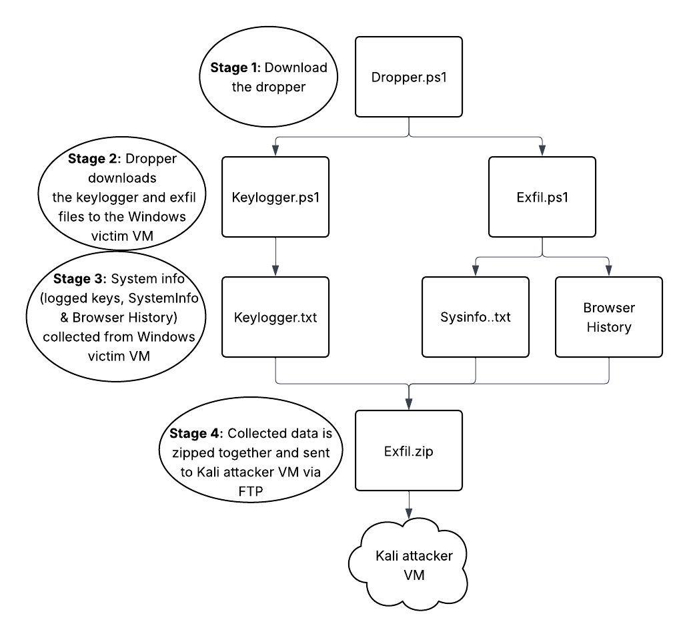
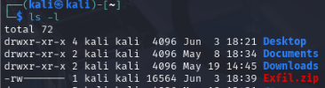

# Detection Engineering Attack Scenario 3

This attack:
* Has the victim download a dropper file, once executed the victim downloads and executes a malicious Keylogger and an Exfiltration script
* Collects information from the victim (logged keys, system info & browser history)
* Zips the collected data together before sending to the Kali attacker VM via FTP
<br>



## Attack Staging
1. On the Windows victim VM, ensure the Edge browser history can be viewed: 
In the **File Explorer**, go to **View Menu > Show > Hidden items**
Edge history should be located in: **C:\Windows\Users\[username]\AppData\Local\Microsoft\Edge\User Data\Default\History**

2. On the Windows victim VM, write the PowerShell file that will download the Keylogger (Keylogger.ps1) and Exfiltration (Exfil.ps1) scripts; save it as **Dropper.ps1** <br>
**An example can be found** [here](https://github.com/Aquellis/TCM-Courses/blob/main/DetEng/Attack3/Dropper.ps1)

3. On the Kali attacker VM, download the keylogger script from [here](https://github.com/securethelogs/Keylogger) and save it as **Keylogger.ps1**
```
wget https://raw.githubusercontent.com/securethelogs/Keylogger/refs/heads/master/Keylogger.ps1
```
Edit the $path variable to be: **$path = "C:\Windows\Temp\exfil\keylogger.txt"**

4. On the Kali attacker VM, write the PowerShell file that will exfiltrate the SystemInfo and browser history from the Windows victim VM; save this as **Exfil.ps1**
**An example can be found** [here](https://github.com/Aquellis/TCM-Courses/blob/main/DetEng/Attack3/Exfil.ps1)

5. On the Kali attacker VM, spin up a python web server to host the **Exfil.ps1** and **Keylogger.ps1** files
```
python -m http.server
```

6. On the Kali attacker VM, start (or install then start) the FTP service:
```
sudo apt install vsftpd
```
Edit the FTP config:
```
vi /etc/vsftpd.conf
Uncomment the line write_enable=YES
```
Restart the vsftpd service: **sudo systemctl restart vsftpd**

To start the service, use **sudo service vsftpd start**

## Attack Walkthrough
1. In the Ubuntu VM, start the Zeek service: <br>
in **/opt/zeek/bin** run: 
```
./zeekctl
deploy 
```
2. Ensure the Kali attacker VM is up and is serving the Exfil & Keylogger files on a web server

3. Ensure the Kali attacker VM has the vsftpd service running

4. On the Windows victim VM, execute the **Dropper.ps1** script to launch the attack

5. On the Kali attacker VM, the data exfiltrated from the Windows victim VM should appear after some time **Exfil.zip** <br>


## Rule & Alert Creation

### Create the First Rule: PowerShell Added to Windows Registry
Open the Elastic logs, use the **event.dataset: "windows.sysmon_operational"** data source and use the search query: <br>
```
event.action : "RegistryEvent (Value Set)" and registry.path : *Microsoft\\Windows\\CurrentVersion\\Run* and registry.data.strings : *ps1
```
Create a new rule based on this custom query:
* Suppress the rule by **host.hostname** and per time period of **5 minutes**
* Schedule the rule to run every **5 minutes** with a lookback time of **5 minutes** 

### Create the Second Rule: SystemInfo and Browser History are Manipulated
Open the Elastic logs, use the **event.dataset: "endpoint.events.file"** data source and use the search query: <br>
```
event.action : ("creation" or "overwrite") and process.name : "powershell.exe" and file.path : *Windows\\Temp\\* and file.name : ("History" or *.txt)
```
Create a new rule based on this custom query:
* Suppress the rule by **host.hostname** and per time period of **5 minutes**
* Schedule the rule to run every **5 minutes** with a lookback time of **5 minutes**

### Create the Third Rule: Data on the Endpoint was Zipped
Open the Elastic logs, use the **event.dataset: "endpoint.events.file"** data source and use the search query: <br>
```
event.action : ("creation" or "overwrite" ) and process.name : "powershell.exe" and file.path : *Windows\\Temp\\* and file.name : *.zip
```
Create a new rule based on this custom query:
* Suppress the rule by **host.hostname** and per time period of **5 minutes**
* Schedule the rule to run every **5 minutes** with a lookback time of **5 minutes**

### Create the Fourth Rule: FTP Activity Detected
Open the Elastic logs, use the **event.dataset : zeek.ftp** data source and use the search query: <br>
```
event.action : "STOR"  and zeek.ftp.arg : *.zip
```
Create a new rule based on this custom query:
* Suppress the rule by **host.hostname** and per time period of **5 minutes**
* Schedule the rule to run every **5 minutes** with a lookback time of **5 minutes**

## Confirm the Alerts Work
Re-launch the attacks as given in the **Attack Walkthrough** section
