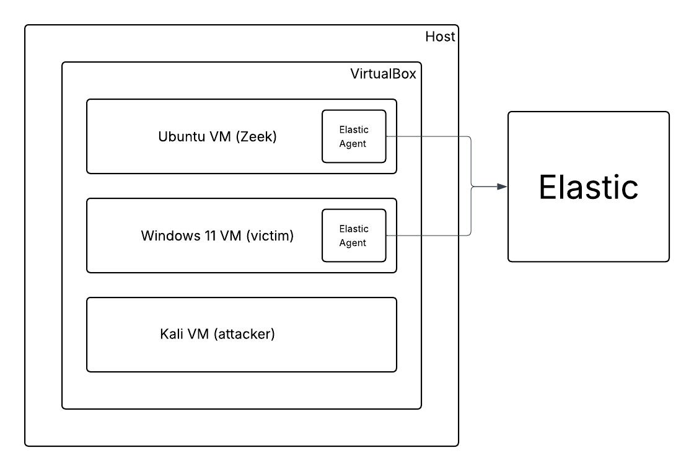

# Detection Engineering for Beginners

This course project includes:
* Adversary emulation via 3 attack scenarios 
* Using Zeek to collect logs from the Windows victim VM
* Creating rules and alerts in Elastic to catch malicious activity

## Architecture

