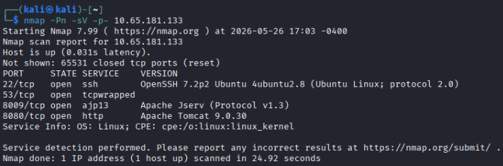
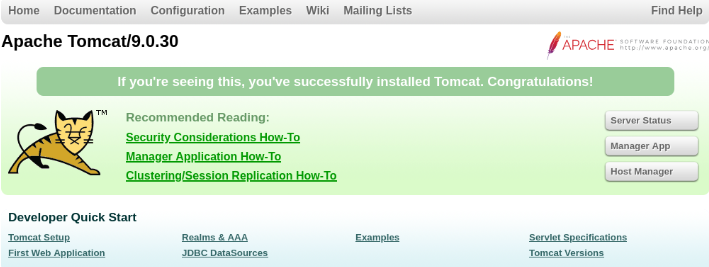
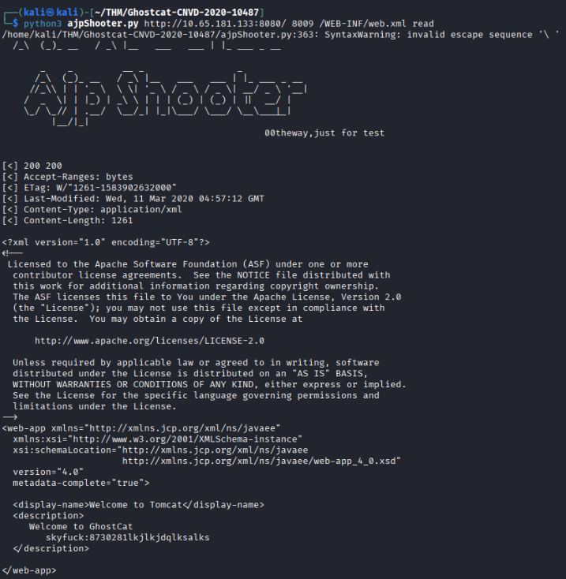
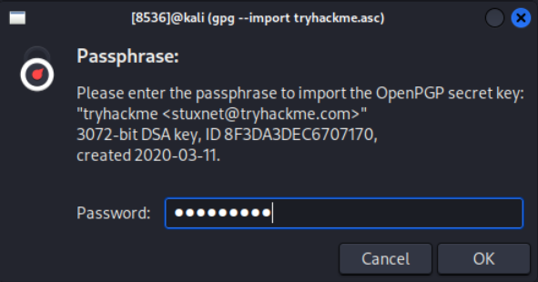
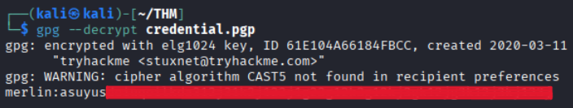
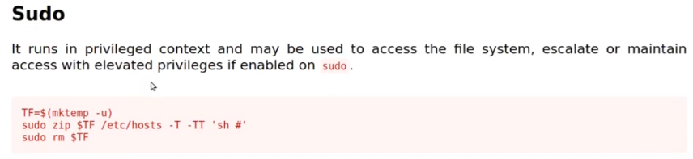

# Course Capstone - tomghost

Here is the walkthrough for the TryHackMe room [tomghost](https://tryhackme.com/room/tomghost).

## Initial Enumeration
First I ran an Nmap scan against the host to see what services are running:



There is an Apache Tomcat web server running on port 8080 and the Apache Jserv Protocol (AJP) running on port 8009. AJP proxies inbound requests to the Tomcat server.

Investigating the Tomcat server we find this page which shows the current version is **9.0.30**. 



## Gaining a Foothold

Using the Tomcat version to search for vulnerabilities, I came across this critical finding:
```
CVE-2020-1938 (Ghostcat): A flaw in the Apache JServ Protocol (AJP) connector
(enabled by default on port 8009). An attacker can read sensitive files (e.g., 
configurations) or execute arbitrary code if they can upload or modify files 
within the web application directory.
```

Now that I have a specific CVE to target, time to search for working exploits. The one I used is found in this [GitHub repo](https://github.com/00theway/Ghostcat-CNVD-2020-10487).

Clone the repo to your machine and use the following commmand to run the exploit script against the vulnerable AJP connector. We're trying to read the /WEB-INF/web.xml file, which is the **web application deployment descriptor** file that defines how the web app is configured and how it handles resources.

```
python3 ajpShooter.py http://[MACHINE IP]:8080/ 8009 /WEB-INF/web.xml read
```

Reading the XML file there is an interesting string included inside the \<description> tags.



It appears to be credentials for the user 'skyfuck': skyfuck:8730281lkjlkjdqlksalks

SSH-ing into the machine using these credentials grants us user-level access into the machine! But this user's home directory doesn't contain the **user.txt** file containing the user flag. However, they do have 2 files:
* credential.pgp
  * a file encrypted using PGP
* tryhackme.asc
  * a PGP private key

### Cracking the Credential File

We can copy these files over to our local machine for further investigation using the command `scp skyfuck@[MACHINE IP]:/home/skyfuck/* .`

Let's convert the contents of the **tryhackme.asc** file into a format that can be understood and cracked by john (AKA [John the Ripper](https://www.kali.org/tools/john/)). 
`gpg2john tryhackme.asc > hash.txt`
The resulting hash should look like this:
```
tryhackme:$gpg$*17*54*3072*7.........480:::tryhackme <stuxnet@tryhackme.com>::tryhackme.asc
```

Our next step is to run john to crack this hash using the **rockyou** wordlist: `john hash.txt --wordlist=/usr/share/wordlists/rockyou.txt` which provides us the **password** for the .asc private key.

Import the .asc file into your machine's keyring: `gpg --import tryhackme.asc` and enter the cracked password when prompted.



Now use the imported key to decrypt the credential.pgp file: `gpg --decrypt credential.pgp` and enter the same cracked password from before if/when prompted. The output contains the  contents of credential.pgp, which happen to be credentials for a user named **merlin**.



Log in to the machine as merlin and find the user flag in **/home/merlin/user.txt**.

## Escalating Privileges

Check what commands merlin can run as sudo using the command `sudo -l` and we have one result: **(root : root) NOPASSWD: /usr/bin/zip**

Time to check out [GTFOBins](https://gtfobins.org/) for a way to use zip as sudo to escalate to root privileges.



*Note: This screenshot doesn't reflect current edits to the GTFOBins website, this was taken from a [video](https://www.youtube.com/watch?v=-Cy4u6fA3Os) created in 2020.*

Following the steps given by GTFOBins grants us root access:
```
TempFile=$(mktemp -u)
sudo zip $TempFile /etc/hosts -T -TT 'sh #'
```

Find the flag in **/root/root.txt**.
