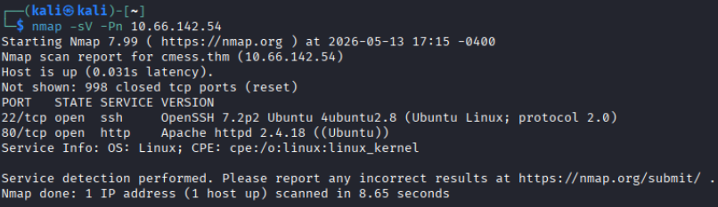
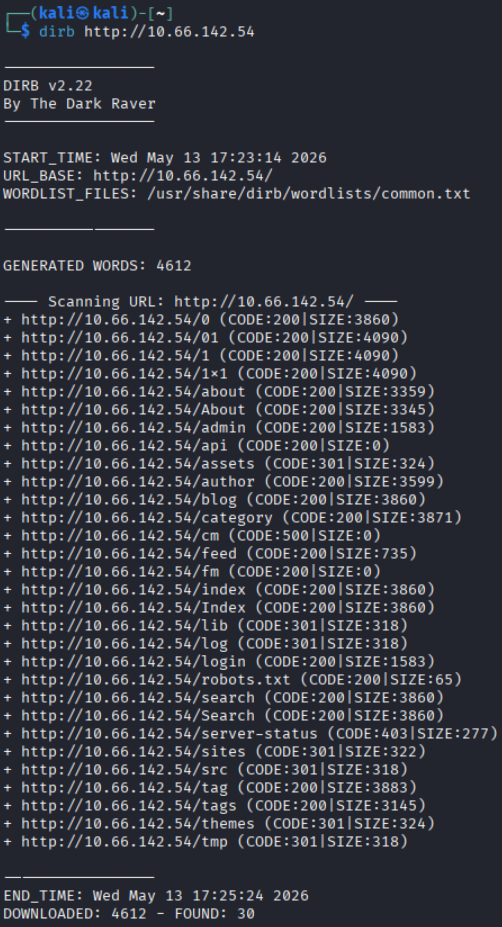
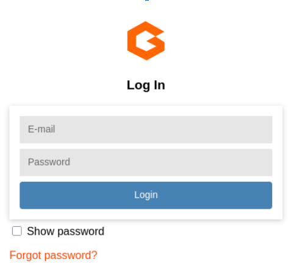
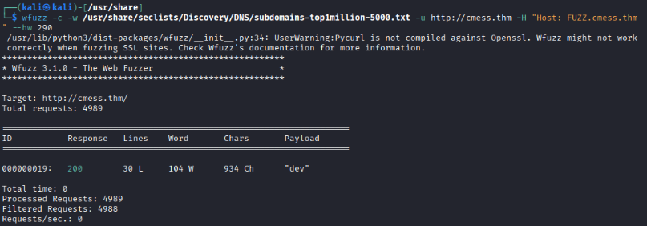
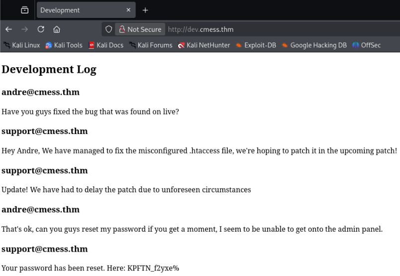
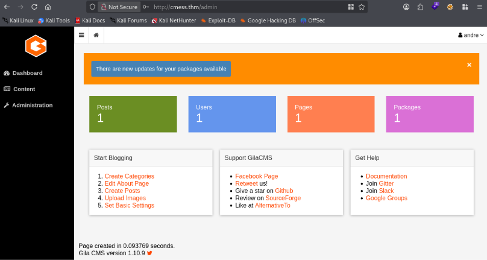
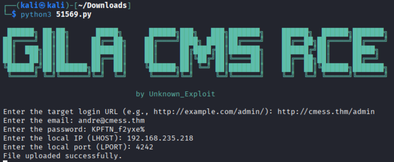
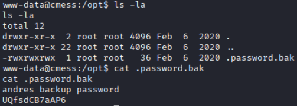
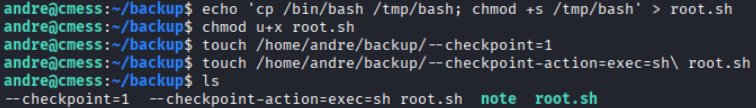
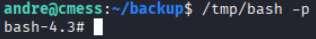

# Course Challenge - CMesS

Here is the walkthrough for the TryHackMe room [CMesS](https://tryhackme.com/room/cmess).

## First Step
This room requires the machine IP & domain to be added to the attacker's **/etc/hosts/** file before starting.

## Initial Enumeration
First I ran an nmap scan against the host to see what services are running:

Since there is a web server running on port 80, let's look here first. Start by running **dirb** against it to discover subdirectories:

An admin panel has been discovered! Save this for later.

There don't seem to be any other paths to look into, so I used another subdirectory enumeration tool **wfuzz**, which found a subdomain that dirb missed.

Navigating to this subdomain directly in the web browser doesn't work, so add it to the **/etc/hosts** file and investigate further.

It appears I've uncovered private messages among the CMess team... who may have pasted **admin credentials** in clear text.

## Gaining a Foothold
Now it's time to use these credentials to log into the **admin panel** discovered earlier:
* email: **andre@cmess.thm**
* password: **KPFTN_f2yxe%**

After logging into the admin panel, the Gila CMS version can be seen: **1.10.9**.

Searching the exploit database there is an [RCE exploit](https://www.exploit-db.com/exploits/51569) that can be used to spawn a reverse shell.

Run the exploit script and configure it to use:
* the CMS site admin page
* the breached credentials discovered earlier
* the local (attacker) IP & listening port 

On the attacker machine, use **netcat** to start listening for incoming connections: `nc -nlvp [port]`

A shell should spawn as **www-data@cmess**. Now it's time to start looking through the file system of this machine.

Notable findings:
* /tmp/andre_backup.tar.gz (something is being backed up)
* /opt .password.bak
* evidence of cron jobs, but www-data cannot access them

Printing the contents of the .password.bak file reveals yet another password:

Using this newly discovered password grants us SSH access as Andre on the machine. The user flag can be found in **user.txt**.

## Escalating Privileges

After gaining user level access in the machine, I have to start searching for escalation paths. Remembering the findings from earlier, there are cron jobs running and something being backed up for Andre.

Looking at Andre's crontab shows the job used to create continuous backups:
`root    cd /home/andre/backup && tar -zcf /tmp/andre_backup.tar.gz *` 

The cron job runs as root and includes a wildcard \* which offers an escalation path by forcing **tar** to include malicious files disguised as arguments.

**Steps for final privilege escalation:**
1. Create a malicious script to spawn a root-level shell:
    * `echo 'cp /bin/bash /tmp/bash; chmod +s /tmp/bash' > root.sh`
2. Create a tar checkpoint that will trigger during the backup execution:
    * `touch /home/andre/backup/--checkpoint=1`
3. Create the tar checkpoint action so the malicious script runs when the checkpoint is reached:
    * `touch /home/andre/backup/--checkpoint-action=exec=sh\ root.sh`
4. Wait until the next backup has executed
5. Run /tmp/bash in privileged mode:
    * `/tmp/bash -p`

Root access has now been achieved!

The root flag can be found in **root.txt**.

## Questions
**1. Compromise this machine and obtain user.txt**

**Answer: thm{c*************430b7eb1903b2b5e1b}**

---

**2. Escalate your privileges and obtain root.txt**

**Answer: thm{9***************85bf5761a93546a2}**
