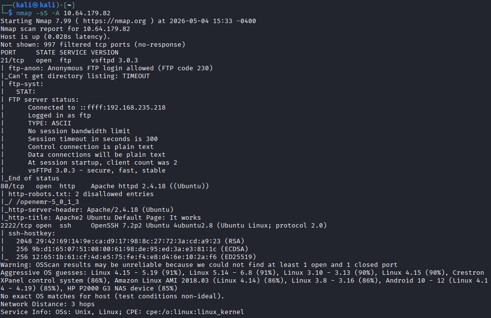
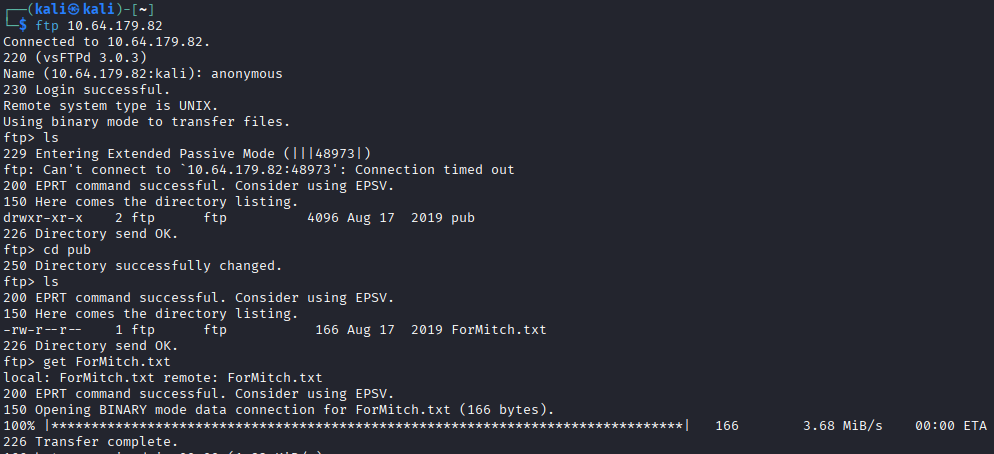
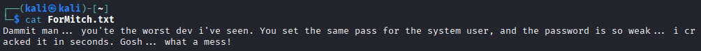
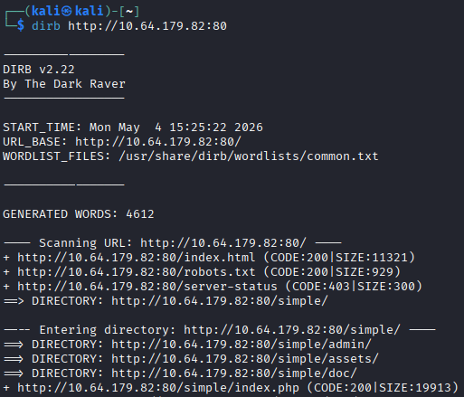
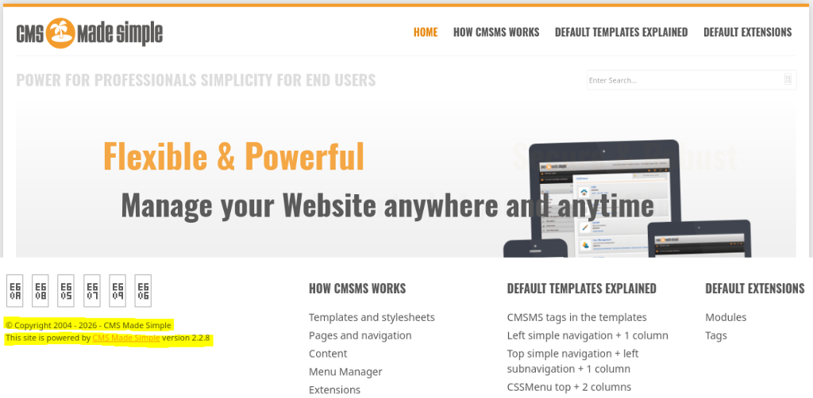
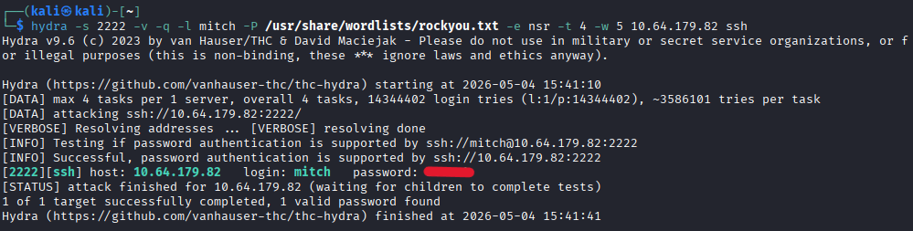
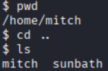
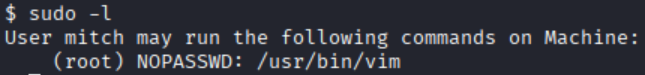
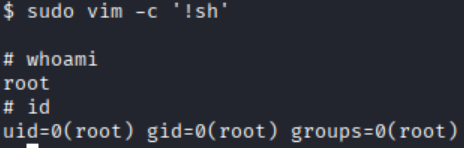

# Course Challenge - Simple CTF

Here is the walkthrough for the TryHackMe room [Simple CTF](https://tryhackme.com/room/easyctf)

## Initial Enumeration
First we run an nmap scan against the host to see what services are running:

We see that an FTP server on port 21 allows for anonymous login, let's check that out for any clues.

After connecting to the FTP server, we find a file **ForMitch.txt**.

Taking that file and opening it's contents it seems that there is a user named **Mitch** whose password we may be able to crack. We will continue our enumeration for now and come back to this later.

Since there is a web server running on port 80, let's look here first. Start by running **dirb** against it to discover subdirectories:

## Questions
**1. How many services are running under port 1000?**

This answer can be found in the Nmap enumeration. 

**Answer: 3**

---

**2. What is running on the higher port?**

This answer can be found in the Nmap enumeration. 

**Answer: ssh**

---

**3. What's the CVE you're using against the application?**

We can answer this by exploring the web server. Navigate to the web server: **http://[machine IP]/simple/**

We see there seems to be Simple CMS hosted here. Looking further we see the version number is **2.2.8**. Now we can look for vulnerabilities affecting this exact version. Perform a web search for 'simple cms version 2.2.8 cves' and we will find the [CVE](https://nvd.nist.gov/vuln/detail/CVE-2019-9053) we're looking for.

**Answer: CVE-2019-9053**

---

**4. To what kind of vulnerability is the application vulnerable?**

Examining the CVE details, we can see that CMA Made Simple 2.2.8 is vulnerable to **SQL Injection (sqli)**.

**Answer: sqli**

---

**5. What's the password?**

To find this answer we must crack the password for the user **mitch**. We'll try brute forcing it with [hydra](https://www.kali.org/tools/hydra/) using the **rockyou** wordlist.

**Answer: s\*\*\*\*\***

---

**6. Where can you login with the details obtained?**

From our hydra results, we see that the credentials can be used for an **ssh login** on port 2222.

**Answer: ssh**

---

**7. What's the user flag?**

To obtain the user flag, login as Mitch and find the flag inside **user.txt**.

**Answer: G\*\*\* \*\*\*, \*\*\*\* \*\*!**

---

**8. Is there any other user in the home directory? What's its name?**

Starting from Mitch's home directory, move up one level and see what other user directories exist.

**Answer: sunbath**

---

**9. What can you leverage to spawn a privileged shell?**

Logged in as Mitch, let's see what the user can run as **sudo**:

Knowing that Mitch can use **vim** as sudo, we go to [GTFOBins](https://gtfobins.org/gtfobins/vim/) to find a way to exploit this.

Spawn a root shell using vim: **sudo vim -c '!sh'**. Confirm root access was achieved using **whoami** and/or **id**.

**Answer: vim**

---

**10. What's the root flag?**

Once root access is achieved, find the flag inside the file **root.txt**.

**Answer: W\*\*\* \*\*\*\*. \*\*\* \*\*\*\* \*\*!**
